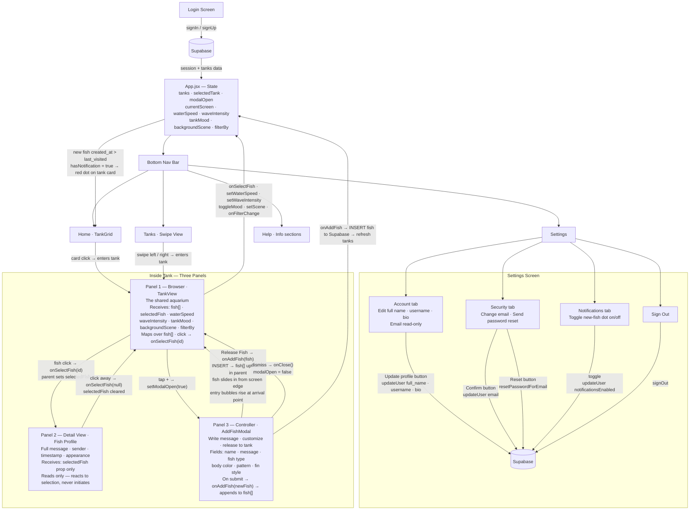

# Tide Lines

A shared fish tank messaging app for international students and diaspora families. Each fish is a message from someone you love. Built with React + Vite, hosted on GitHub Pages.

**Live site:** https://akezi4h-dev.github.io/Fish-Tank/

---

## Architecture

---

## AI 201 — ESF Documentation

### AI Direction Log

**Project:** Tide Lines — AI 201 Project 2
**Format:** Each entry names the prompt given, what AI produced, what was changed, and why.

---

#### Entry 1 — Domain & Concept Direction

**Session:** Project kickoff
**What I asked:** I told Claude the domain was "my github repo" before clarifying. When I clarified, I said I was going to write a design intent document tonight.
**What AI did:** Claude correctly paused and waited. It did not generate a domain concept on its own or try to interpret "my GitHub repo" as a theme. It asked clarifying questions: was it a portfolio viewer of my repos, or something about this specific repo?
**What I did instead:** I came back with a fully personal design intent — *Tide Lines*, a shared fish tank where each fish is a message from someone you love, rooted in my experience as an international student. The fish metaphor came from me, the name "Tide Lines" came from me, the emotional framing ("connection feels ambient, not obligatory") came from me.
**Why it matters:** The assignment says to be the Art Director of a system. I didn't let AI generate the concept. The domain is personal and specific to my life — AI couldn't have invented it.

---

#### Entry 2 — Build Order Enforcement

**Session:** After design intent was submitted
**What I asked:** I gave Claude the full spec and said: *"Build it one component at a time, starting with the data model and parent state."*
**What AI produced:** Claude built only the parent App component with the full useState shape and mock data — no UI, no components, just state and handlers. It explicitly returned `null` from the render.
**What I did:** I approved this and said "yes" to proceed to Screen 1.
**Why it matters:** The assignment explicitly warns that AI will try to build all three panels at once and make architectural decisions you didn't approve. I enforced the build order: parent state → Screen 1 → Screen 2 → Screen 3. Each step required my explicit go-ahead. Claude did not deviate from this sequence.

---

#### Entry 3 — Fish Type Connection (Caught and Directed)

**Session:** After all three screens were built
**What AI produced:** Claude built `TankView.jsx` with its own internal `FishSVG({ color })` component that rendered a single hardcoded generic fish shape — an ellipse + triangle tail + eye. The `fish.type` field from state was passed into the fish object but was never read in the tank renderer. Every fish in Screen 2 looked identical regardless of type.
**What I asked Claude to show me:** *"Show me where in the code the fish type from state is being used to determine what renders in the tank. If it's not connected, fix it."*
**What I directed:** I caught the disconnection and directed Claude to extract all fish shapes into a shared `FishSVGs.jsx` file, export a single `FishSVG` component that takes both `type` and `color` as props, and use it in both TankView and AddFishModal. Both screens now import from the same source.
**Why it matters:** This is the exact failure mode the assignment warns about — AI builds something that looks connected but the data isn't actually flowing. `fish.type` was in state. It just wasn't being read. I caught it and directed the architectural fix.

---

#### Entry 4 — Custom Artwork Over AI-Generated SVGs

**Session:** After fish type fix
**What AI produced:** Claude had generated five hand-coded SVG fish (clownfish, angelfish, betta, goldfish, pufferfish) using basic geometric shapes — ellipses, polygons, lines. They were functional but generic. The AI designed them from scratch with no reference to my visual intent.
**What I did:** I had my own custom SVG artwork in the repo folder (`Untitled (4)/`): Angel Fish, Clownfish, Eel, Lion Fish, Otter, Puffer Fish, Seal, Shark, Turtle — 9 files. I directed Claude to replace the AI-generated SVGs entirely with my artwork.
**What changed:** The AI's geometric fish shapes were deleted. All 9 custom files were moved to `src/assets/fish/`, imported into `FishSVGs.jsx`, and the `FishSVG` component was rewritten to render `` tags pointing to my files. The color slider still applies `hue-rotate` on top of the real artwork.
**Why it matters:** Visual direction is mine. AI generated placeholder shapes because it had nothing else to work with. When I had real assets, I replaced the placeholders. The final app reflects my artwork, not Claude's geometric approximations.

---

#### Entry 5 — Expanding Fish Types (9 vs 5)

**Session:** Same session as custom artwork
**What AI assumed:** The original spec and the AddFishModal were built for exactly 5 fish types — clownfish, angelfish, betta, goldfish, pufferfish — matching the spec I provided.
**What I directed:** When I brought in my custom SVG folder, I had 9 files, not 5. I explicitly asked: *"can i add all the images and the types to the modal selector."* I directed expanding FISH_TYPES from 5 to all 9: clownfish, angelfish, eel, lionfish, otter, pufferfish, seal, shark, turtle.
**What changed:** `FISH_TYPES` array in `FishSVGs.jsx` expanded. The modal selector now arrows through all 9. The tank can render all 9 types.
**Why it matters:** The final creative scope of the species in the tank is my decision. AI had no knowledge of the Otter, Seal, Shark, Turtle, or Eel until I surfaced the files. I defined what belongs in this tank.

---

#### Entry 6 — Replacing Caustic Rays with Sine Wave Water Effect

**Session:** After all three screens were complete and deployed
**What AI produced:** Claude implemented a water effect with three layers: caustic light rays (diagonal SVG rectangles spanning the tank), a surface shimmer band, and floating particles. The caustic layer rendered as large diagonal stripe shapes overlaid across the tank.
**What I rejected:** The diagonal stripes looked wrong — they obscured the tank background instead of enhancing it. I directed Claude to remove the caustic rays entirely.
**What I directed:** I gave Claude a full replacement spec: horizontal SVG sine wave paths only, no diagonal shapes, nothing that blocks the tank background. I specified the technique — cubic bezier sine paths, separate X drift and Y undulation on two different elements — and the visual parameters: 3 waves at different depths, thin strokes at very low opacity, subtle particles, minimal surface shimmer.
**Why it matters:** The water effect is an atmospheric layer. I defined what atmospheric means for this project: horizontal, subtle, background-visible. When AI produced something that contradicted that, I caught it visually, described exactly what was wrong, and gave a precise replacement directive. The final effect looks like water because I directed it to look like water.

---

#### Entry 7 — Connecting Wave Slider to WaterEffect Speed

**Session:** Continued session after water effect rewrite
**What AI produced:** The WaterEffect component used hardcoded animation durations. The Waves slider controlled fish swim speed but wave animation speed was static — sliding the control did nothing to the wave lines themselves.
**What I directed:** I asked for the wave slider to make the waves faster when moved to the right. I directed Claude to pass `waveIntensity` as a `speed` prop into `WaterEffect` and divide each wave's animation durations by that value.
**What changed:** `WaterEffect` now accepts `speed={waveIntensity}` from `TankView`. Both X and Y durations are divided by `speed` at render time. Moving the slider right increases speed across all three wave lines simultaneously.
**Why it matters:** The slider was already wired to fish speed. Extending it to wave speed makes the control feel complete — everything in the tank responds to the same input. I identified the gap and directed the fix.

---

#### Entry 8 — Enlarging Tank Cards on Screen 1

**Session:** Continued session
**What AI produced:** The TankGrid used a `maxWidth: 800px` container with small gaps. The tank cards were functional but small relative to the available screen space.
**What I directed:** I asked for the tanks to be bigger on the first screen. I directed Claude to widen the grid to `maxWidth: 1100px` and increase column gaps to 32px.
**Why it matters:** Layout scale is a visual direction decision. The cards are the primary UI element on Screen 1 — they should read as fish tanks, not thumbnails. Widening the grid gives the preview fish more room and makes the emotional content of each tank more legible at a glance.

---

#### Entry 9 — Tank Management Buttons (Pin, Invite, Mute, Archive)

**Session:** New session
**What I directed:** I specified four new circular icon buttons beneath each tank card on Screen 1 — pin, invite, mute, and archive — each with its own behavior and state toggle. I defined the state architecture: all booleans (`pinned`, `muted`, `archived`) live on the tank object in parent state, invite modal state also lives in the parent, and cards call callbacks only.
**What changed:** `App.jsx` got four new handlers and two new state fields. A new `InviteModal.jsx` was created. `TankGrid.jsx` was updated with the button row, pin sort logic, and archived filter with a "show archived" toggle.
**Why it matters:** Four separate features, all controlled from parent state. I specified that the invite modal must render at the app level — not inside the card — which prevents the modal from being trapped inside a button's stacking context.

---

#### Entry 10 — Full Responsive Layout

**Session:** Continued session
**What I directed:** A detailed spec for responsive behavior across all screens: 3-column desktop, 2-column tablet, 1-column mobile. Bottom sheet panels for mobile nav, larger touch targets, smaller title font, modal height limits. CSS media queries only — no external libraries.
**What changed:** Grid layout properties moved from inline styles to CSS classes (required because media queries cannot override inline styles). Media queries added to `TankGrid.css`, `TankView.css`, `AddFishModal.css`, and new `InviteModal.css`.
**Why it matters:** I defined the exact layout behavior at each breakpoint. The bottom sheet behavior for nav panels was a specific interaction decision — panels should feel native on mobile, not like floating cards scaled down.

---

#### Entry 11 — Click-to-Stop Fish Interaction + Separated Hover State

**Session:** Continued session
**What I directed:** Two-mode fish interaction: hover (desktop only, existing behavior preserved) and click/tap (stops the fish in place, locks the bubble). Local `hoveredFishId` inside TankView for hover only; parent `selectedFish` for the stopped state only. Clicking the tank background dismisses the stopped fish.
**What changed:** `TankView.jsx` gained local `hoveredFishId` state. Hover handlers were decoupled from `onSelectFish`. New `handleFishClick` and `handleTankClick` added. Stopped fish get `animationPlayState: 'paused'` and `.fish-stopped` CSS glow class.
**Why it matters:** The original code conflated hover and selected into one parent state value. I directed the split: hover is local and visual, stopped is shared state. This distinction is essential for mobile where there is no hover.

---

#### Entry 12 — Tank Title Centered

**Session:** Continued session
**What I directed:** Tank title in Screen 2 header should be truly centered relative to the full bar width, not offset after the back button. Directed `position: absolute; left: 50%; transform: translateX(-50%)`.
**Why it matters:** "Centered" in a flex row after a left-aligned button is not actually centered. I specified the correct technique.

---

#### Entry 13 — Fish Size Direction (200px)

**Session:** Continued session
**What AI defaulted to:** Fish at 70px — conservative, safe, fits multiple fish without overlap.
**What I directed:** 1.5x (105px), then decided 200px. Each fish is a message from someone you love — they should feel substantial, not small.
**Why it matters:** Fish size is a visual direction decision. The default was chosen by AI for safe layout. I overrode it twice to arrive at a size that matches the emotional weight the fish are supposed to carry.

---

#### Entry 14 — Supabase Auth & Full Data Integration

**Session:** New session after visual build was complete
**What I directed:** I asked Claude to connect Supabase to the project and walk through auth, live data, and all CRUD operations. I provided the project URL and anon key, specified the exact table schema (tanks, fish, tank_members with invite_code), wrote the RLS SQL myself in the Supabase editor, and approved each step before it was wired into the app.
**What changed:** `supabaseClient.js` was created. `LoginScreen.jsx` was rewritten with real `signInWithPassword` / `signUp` calls. `App.jsx` replaced all mock data with live Supabase queries — `loadTanks`, `addFish`, `addTank`, `joinTank` — and auth state was wired via `getSession` + `onAuthStateChange`.
**Why it matters:** The move from mock data to live Supabase was a deliberate architectural decision I directed step by step. I chose the schema, wrote the SQL, set the RLS policies. AI connected the wiring I designed — it didn't design the database.

---

#### Entry 15 — RLS Debugging and Policy Repair

**Session:** Continued Supabase integration session
**What happened:** After connecting Supabase, `addTank` returned a 403 RLS error. Claude traced the root cause to the wrong anon key format (`sb_publishable_` prefix doesn't attach the JWT to requests, so `auth.uid()` returns null). A second round of debugging found that the `tanks` table had zero RLS policies. A third issue: the `tank_members` SELECT policy was missing, and `fish` had no policies at all.
**What I directed:** I ran diagnostic SQL in the Supabase editor at Claude's direction, confirmed the policy gaps, and approved each `CREATE POLICY` block before it was run. I also directed a `join_tank_by_invite` RPC to solve the chicken-and-egg problem: a new user can't SELECT from `tanks` to find a tank by invite code because they're not yet a member — but they need to find the tank to become a member. The RPC runs with `SECURITY DEFINER` to bypass RLS for the lookup only.
**Why it matters:** Every RLS policy in this database was deliberately reviewed and approved by me. I caught the gaps by running diagnostic queries, not by guessing. The RPC solution was a real architectural decision about where to break the RLS boundary safely.

---

#### Entry 16 — Red Notification Dot Architecture

**Session:** After Supabase integration was stable
**What I directed:** I specified a full notification system: a `last_visited` table tracking when each user last opened each tank, an upsert on every tank open, and `hasNotification` computed in the parent from Supabase data and passed down to each card as a prop. I explicitly ruled out the card fetching its own data or computing its own notification state.
**What changed:** `last_visited` table and RLS were created in Supabase. `loadTanks` gained a third parallel query for visited timestamps, then computed `hasNotification` per tank. `selectTank` became async and fire-and-forgets an upsert while immediately clearing the dot in local state. `TankGrid` renders a 10px red circle absolutely positioned top-right only when `tank.hasNotification` is true.
**Why it matters:** I specified the state rule explicitly: `hasNotification` is a derived value computed in the parent, not fetched by the card. This is the same props-down/events-up principle enforced throughout the app.

---

#### Entry 17 — Login Screen Redesign: Carousel + Frosted Glass

**Session:** After notification dot feature
**What I directed:** I gave a full redesign spec for the login screen: a full-viewport carousel of animated tank previews as a background layer, and the login form as a frosted glass card floating on top. I specified the exact structural layering — carousel as `position: absolute` background, form as `position: relative` centered by the flex root. I specified the frosted glass treatment (`backdrop-filter: blur(12px)`, dark translucent background, `border-radius: 24px`), the teal button color (`#1d9e75`), and the Join Tank row beneath the auth buttons.
**What changed:** `LoginScreen.jsx` was completely rewritten with a `Carousel` component rendering mock tank data via the existing `TankPreview` component exported from `TankGrid.jsx`. `LoginScreen.css` was rebuilt from scratch.
**Why it matters:** The original login screen was a plain dark card. The redesign communicates the product before login — you see fish tanks in motion before you even sign in. That's a deliberate product direction decision I specified completely.

---

#### Entry 18 — Carousel: From Snap Navigation to Infinite Ambient Scroll

**Session:** Continued login redesign
**What I rejected:** The first carousel implementation used index-based snap navigation with auto-advance (setInterval), left/right arrow buttons, and per-card opacity/scale that dimmed non-centered cards.
**What I directed:** I replaced the entire logic with a continuous infinite scroll — no arrows, no index state, no timers. The card array is rendered twice back-to-back, and a single CSS keyframe (`translateX(0)` to `translateX(-50%)`) loops infinitely at 40s linear. I also directed the final card size (260×380px), larger fish inside the previews (65×46px), and removal of the tank name labels below each card.
**Why it matters:** The carousel isn't a navigation element on the login screen — it's atmosphere. Interactive navigation implies the cards are meaningful destinations before login, which they aren't. An ambient drift reads as environmental backdrop, not UI chrome.

---

#### Entry 19 — Session Persistence, Welcome Message, and First Name Signup

**Session:** New session
**What I directed:** I specified three connected features: persistent login using Supabase's localStorage session, a welcome message on Screen 1 showing the user's first name, and a first name prompt added to the signup flow that stores `full_name` in Supabase `user_metadata`.
**What changed:** The `authLoading` null return was replaced with a teal "Tide Lines" loading screen so the login screen never flashes on return visits. `App.jsx` derives `firstName` from `user_metadata.full_name` or falls back to the email prefix. `TankGrid` receives `userName` and shows "Welcome back, / [name]". `LoginScreen` gained `showFirstName` state — clicking Sign up once reveals the first name field, clicking again completes registration.
**Why it matters:** These three features are connected by one product principle: the app should feel like it knows you. The welcome message is the payoff of storing the name at signup. I specified the full chain — collection → storage → display — and the exact fallback logic for users who signed up before the name field existed.

---

#### Entry 20 — Persistent Bottom Navigation Bar

**Session:** Continued session
**What I directed:** I gave a full spec for a persistent bottom nav bar — a floating pill-shaped bar where the active button expands into a labeled pill. I specified 4 tabs: Home, Tanks, Settings, Help. Bar style: frosted glass pill, `rgba(4,16,30,0.9)`, `backdrop-filter: blur(12px)`. Inactive: icon only, 45% opacity. Active: teal pill, icon + label, `0.3s ease` transition. State rule: `currentScreen` lives in the parent, nav reads it as a prop and calls `onNavigate`.
**What changed:** `BottomNav.jsx` and `BottomNav.css` were created. `SettingsScreen.jsx` created with display name, change email, password reset, and sign out. `HelpScreen.jsx` created with 4 content sections. `App.jsx` gained `currentScreen` state and routing. `BottomNav` is hidden when in the swipeable tanks experience.
**Why it matters:** The navigation architecture was mine to define. I specified which features belong in the nav, which don't, and how state should flow. The active pill animation was a specific visual direction decision.

---

#### Entry 21 — Tanks Nav: List View Rejected, Swipeable Experience Directed

**Session:** Continued session
**What AI built first:** The Tanks tab rendered a flat list — tank name, fish count, notification dot, tap to open. Functional but passive.
**What I directed:** I replaced the list entirely with a full-screen swipeable tank experience. Tapping Tanks takes you directly into a TankView with fish swimming and you swipe left/right to move between tanks. Dot indicators at the top show position. I specified the state architecture: `swipeTankIndex` in parent, touch detection via delta > 50px, keyboard arrow key support, and `translateX` CSS transition with both tanks visible simultaneously during the slide.
**What changed:** `TankListView.jsx` replaced by `SwipeTankView.jsx`. Touch events use native capture-phase listeners so child elements can't block them. `addFish` updated to accept an explicit `tankId` parameter for swipe mode.
**Why it matters:** A list of tanks is a utility screen. A swipeable tank view is an experience. The product direction is that tanks are living spaces you move through, not items in a directory.

---

#### Entry 22 — Login Screen Title Hierarchy

**Session:** Continued session
**What I directed:** I asked to add a large "Tide Lines" title at the top of the login screen and a "Sign up" label inside the card.
**What changed:** A `.login-hero-title` element was added absolutely positioned at the top of the full viewport (`top: 36px`, `3.2rem`, teal with soft text shadow). The card's internal title reads "Sign up" at a smaller weight. Two headings, two purposes.
**Why it matters:** Hierarchy is a visual direction decision. The hero title is branding — it belongs to the whole screen. The card title is a form label — it belongs to the interaction.

---

#### Entry 23 — Fish Entrance Animation and Entry Bubbles

**Session:** New session
**What I directed:** When a new fish is added via the modal, animate it sliding in from a random screen edge with a cluster of rising bubbles at the entry point. I specified `isNew` and `enterFrom` flags on the fish object in parent state, a `useEffect` keyed on a derived `newFishIds` string to clear flags after 2500ms, CSS keyframes for left/right entry, and an `EntryBubbles` component using lazy `useState` initializer for stable randomised bubble data with `onAnimationEnd` self-cleanup.
**Why it matters:** The entrance animation makes a new message feel like an event. The lazy initializer pattern ensures bubble randomness is stable across re-renders. The derived string dependency prevents infinite re-render loops when clearing the `isNew` flag.

---

#### Entry 24 — Rising Bubbles on Fish Click

**Session:** Continued session
**What I directed:** When a fish is clicked, release a rising bubble cluster from the exact click point. I specified `getBoundingClientRect()` for tank-relative coordinates, `Date.now()` keys so rapid clicks produce independent clouds, and a `ClickBubbles` component that calls `onDone` when all bubbles finish animating.
**Why it matters:** The click needed a physical response. Bubbles rising from where you touch reads as tactile — you disturbed the water. Independent keys per click set means no race conditions between overlapping animations.

---

#### Entry 25 — Font Switch to Adobe Typekit pt-serif

**Session:** Continued session
**What I directed:** Replace Patrick Hand (Google Fonts) with `pt-serif` via Adobe Typekit. I provided the exact `<link>` tag.
**Why it matters:** Typography is a visual direction decision. pt-serif gives the app a literary quality that matches the emotional register of Tide Lines — messages between people should feel like correspondence.

---

#### Entry 26 — Full Light Color Scheme Across All Screens

**Session:** Continued session
**What I directed:** A complete overhaul to `#F8F7FF` background, `#211E4A` navy text, `rgba(33,30,74,…)` borders, `#1d9e75` teal accent — applied across login, panels, modals, header, nav, and home screen. I specified scoping the light background to `.grid-page` so the tank view stays dark.
**Why it matters:** The light scheme reads warmer and more personal than generic dark-mode UI. Scoping it to the class rather than body was a deliberate architectural decision to preserve the underwater darkness of the tank itself.

---

#### Entry 27 — Scene-Based Dynamic Bar Colors with Night Mode

**Session:** Continued session
**What I directed:** The header and bottom nav in the tank view change color per scene (`sea`, `jungle`, `deep`) with separate darker `night` tones. Both bars always read from the same `sceneTheme[backgroundScene][tankMood]` value — a matched pair. Transitions at `0.4s ease`.
**Why it matters:** The bars are part of the tank environment, not floating chrome. Having them match each other and respond to the scene reinforces the spatial metaphor of being inside a specific underwater place.

---

#### Entry 28 — Fish Click Glow: Drop-Shadow on Fish Silhouette

**Session:** Continued session
**What I directed:** Remove the white box-shadow halo on clicked fish and replace with layered `drop-shadow` filters that trace the actual fish silhouette.
**Why it matters:** `box-shadow` glows around the rectangular bounding box. `drop-shadow` follows the pixel content of the artwork. The effect should feel like the fish is emitting light, not like a UI selection rectangle.

---

#### Entry 29 — Settings Screen Dashboard Redesign

**Session:** New session
**What I directed:** A full two-panel dashboard layout: 220px sidebar with logo, initials avatar, nav links (Account / Security / Notifications), Sign Out in coral red; main content panel with three tabs — Account (two-column form grid), Security (email + password reset), Notifications (toggle stored in `user_metadata`). Mobile collapses sidebar to a horizontal icon strip.
**Why it matters:** The original settings screen was a single column of form fields. The dashboard layout gives each concern its own room and matches the intentionality of the rest of the app.

---

#### Entry 30 — Unified navBarStyle: Single Source of Truth for Both Nav Pills

**Session:** Continued session
**What I directed:** Extract a single `navBarStyle` JS object defining every shared nav pill property and spread it into both `BottomNav.jsx` and `TankView.jsx`. Each component overrides only `background`. Strip container rules from both CSS files. Align all icon colors: `rgba(255,255,255,0.55)` inactive, `#ffffff` active.
**Why it matters:** Two CSS files defined "the same" styles separately and kept diverging. A shared constant is the only structural guarantee of consistency — the same single-source-of-truth principle applied to design tokens.

---

[Full AI Direction Log →](docs/ai-direction-log.md)

---

### Records of Resistance

**Format:** Each entry names the AI output, why it was wrong or insufficient, what was done instead, and why that's better.

---

#### Resistance 1 — AI Duplicated Fish Shape Logic Across Two Components

**What AI gave me:**
When Claude built AddFishModal (Screen 3), it defined five fish SVG functions inside the modal file itself — `ClownfishSVG`, `AngelfishSVG`, `BettaSVG`, `GoldfishSVG`, `PufferfishSVG` — and used them only in the modal. Separately, TankView (Screen 2) had its own internal `FishSVG` component that was a completely different generic shape. The same concept — "render a fish" — existed in two places with two different implementations.

**Why I rejected it:**
This is exactly the duplication problem the assignment is built to teach against. The assignment's architectural rule is single source of truth. Having fish rendering logic in two places means if I change one, the other doesn't update. It also means the fish in the modal selector and the fish in the tank would never match — which is exactly what happened: users picked a clownfish in the modal and saw a generic blob in the tank.

**What I did instead:**
I directed Claude to extract all fish shapes into a single shared file, `src/components/FishSVGs.jsx`, and export one `FishSVG` component that both TankView and AddFishModal import. The fish type and color flow through props. One file. One component. Both screens use it.

**Why it's better:**
Now the fish you pick in the modal is exactly the fish that swims in the tank — because they are rendered by the same component reading from the same source. If I change a fish's look, it updates in both places automatically. The modal and the tank are now in sync by design, not by coincidence. This is what single source of truth actually means in practice.

---

#### Resistance 2 — AI Used Generic Placeholder Fish in Screen 1 Preview

**What AI gave me:**
The first version of `TankPreview` in `TankGrid.jsx` rendered an SVG tank with hardcoded generic fish shapes inside — a fixed ellipse body, polygon tail, and eye, drawn directly in the SVG using SVG coordinate transforms. These preview fish had no connection to `fish.type` or `fish.color` from state. They were decorative placeholders: every tank card showed the same orange fish regardless of what was actually in the tank.

**Why I rejected it:**
The design intent says the tank is a living preview of messages from real people. If Mom sent a clownfish and Leo sent a goldfish, the tank card on Screen 1 should show a clownfish and a goldfish — not two identical generic blobs. The preview needs to reflect actual state. Showing wrong fish breaks the user's mental model of what's inside the tank before they even open it.

**What I did instead:**
I directed Claude to replace the hardcoded SVG fish with real `FishSVG` components from `FishSVGs.jsx`, using `fish.type` and `fish.color` from `tank.fish.slice(-3)`. The preview now shows the 3 most recent actual fish at ~40% scale with idle swim animations. The Add New Tank card was explicitly kept empty — no fish, ever.

**Why it's better:**
The tank cards on Screen 1 are now truthful. You can glance at the grid and actually see whose fish are in which tank before you open it. The preview communicates real information from state instead of being decorative noise. It also means there is no redundant fish rendering code — the preview reuses the same `FishSVG` component as the full tank view, so any future artwork update is reflected everywhere at once.

---

#### Resistance 3 — AI's Generated SVG Artwork Was Not My Visual Direction

**What AI gave me:**
Before I provided my custom SVG files, Claude generated its own fish illustrations using basic SVG geometry: ellipses for bodies, polygons for tails, lines for stripes, circles for eyes. The clownfish was an orange ellipse with white stripe ellipses overlaid. The angelfish was a diamond shape. The betta was a purple ellipse with path fins. These were functional but they were AI-invented visual designs — not mine.

**Why I rejected it:**
My design intent specifies a visual mood: deep ocean, atmospheric, bioluminescent. The AI-generated fish were generic geometric approximations with no relationship to that mood or to any actual fish illustration style. More importantly, I had already created custom SVG artwork. AI did not know this artwork existed. The placeholder shapes had no place in the final product.

**What I did instead:**
I surfaced my custom artwork from `Untitled (4)/` — 9 SVG files I had designed. I directed Claude to copy them into `src/assets/fish/`, import them into `FishSVGs.jsx`, and replace the AI geometry with `` tags pointing to my files. The `hue-rotate` filter was preserved so the color slider still works on top of my artwork. Every fish the user sees in this app — in the modal, in the tank, in the preview cards — is my illustration, not Claude's.

**Why it's better:**
The app now has a consistent visual identity that matches the Tide Lines design intent. The fish have character and style — they look like illustrations, not programmer art. The hue-rotate approach means the color picker still works on top of my artwork, so I kept the functional feature without sacrificing the visual direction. AI-generated geometry would have made the app feel generic; my illustrations make it feel personal.

---

#### Resistance 4 — AI Added Diagonal Caustic Stripe Shapes That Obscured the Tank

**What AI gave me:**
When I asked for a water/light effect in Screen 2, Claude implemented a three-layer `WaterEffect` component. One of the layers was "caustic light rays" — multiple SVG rectangles rotated at steep diagonal angles, spanning the full height of the tank, with a slow drift animation. These appeared as large diagonal stripe shapes overlaid across the entire tank background.

**Why I rejected it:**
The diagonal stripes looked wrong immediately. They didn't read as underwater light — they read as angled overlays obscuring the tank. The background scene (ocean gradient, coral, deep sea) was meant to be visible through all effects. Large opaque-looking diagonal shapes across the tank contradicted that. The effect was more distracting than atmospheric.

**What I did instead:**
I directed Claude to remove the caustic rays layer entirely and rebuild the water effect from scratch using horizontal SVG sine wave paths. Three sine waves at different depths, each with its own drift speed, vertical undulation, and amplitude. The waves are subtle strokes (`strokeWidth: 1.5`, opacity 6%) that read as water lines rather than light rays. The separation of horizontal drift (X animation) and vertical undulation (Y animation) was achieved by wrapping the SVG in a parent div with independent transforms.

**Why it's better:**
The sine wave lines look like actual water. They are horizontal — which matches how water behaves physically. They are thin strokes at very low opacity, so the tank background is fully visible through them. The two-axis animation (X drift + Y undulation on separate elements) creates genuinely organic-feeling movement without interfering with each other via CSS transform conflicts. The effect adds atmosphere without competing with the fish or the background.

---

#### Resistance 5 — AI Conflated Hover and Selected Fish into One Parent State Value

**What AI gave me:**
The original fish interaction in TankView used a single `selectedFish` value in parent state for everything — when you hovered a fish, it called `onSelectFish(fishId)` to set parent state, and when you left, it called `onSelectFish(null)` to clear it. Hover and click both wrote to the same parent state field. There was no distinction between "cursor is over this fish" and "this fish is stopped."

**Why I rejected it:**
This conflation broke the design I wanted. If hover and stopped share the same state, then: moving your cursor away from a stopped fish would clear it (the `onMouseLeave` called `onSelectFish(null)`), making it impossible to keep a fish stopped. On mobile there is no hover at all, so the entire interaction model would be wrong. And parent state should not be updated on every cursor movement — hover is purely visual and local.

**What I did instead:**
I directed Claude to split the state: local `hoveredFishId` inside TankView (using `useState`) for hover only, and parent `selectedFish` for the stopped/clicked state only. Mouse enter/leave only touch local state. Click/tap only touches parent state. The bubble displays whichever is active, with stopped taking priority. The `handleTankClick` handler clears the stopped fish when the background is tapped.

**Why it's better:**
The interaction now works correctly on both desktop and mobile. Hover is fast and local — it doesn't trigger parent re-renders on every mouse enter/leave. Stopped fish stay stopped even when the cursor moves away, because the stopped state is independent of cursor position. On mobile, tap sets the stopped state directly with no hover involved. The two states can coexist — you can have a fish stopped and a different fish hovered simultaneously. The architecture matches the actual semantics of the feature.

---

#### Resistance 6 — AI Used Conservative Fish Size That Undersold the Emotional Weight

**What AI gave me:**
The fish were sized at 70px wide throughout the app — a default that ensured multiple fish could fit in view without overlap and that nothing felt crowded. It was technically safe and layout-stable.

**Why I rejected it:**
70px fish are small. In the context of Tide Lines — where each fish is a message from someone you love, possibly someone far away — small fish read as decorative background elements, not as meaningful objects. The app is built around the emotional presence of these fish. They need to feel like the main thing in the tank, not like ambient decoration.

**What I did instead:**
I directed Claude to increase the size first to 105px (1.5x), then decided that was still not bold enough and directed 200px. At 200px each fish is a significant visual presence that fills the tank meaningfully and commands attention the way a real fish in a tank does.

**Why it's better:**
The fish are the entire point of the app. At 200px they read as the primary content rather than as UI decoration. The larger size also makes the custom SVG artwork — which I drew — actually visible in detail. Small fish compress the artwork into thumbnails where the illustration quality is lost. Large fish let the artwork be seen. This was a visual direction decision, not a layout optimization.

---

#### Resistance 7 — AI Used Snap Carousel With Arrows Instead of Ambient Drift

**What AI gave me:**
The first carousel implementation was a conventional snap carousel: index state, a `setInterval` auto-advance every 4 seconds, left and right arrow buttons, per-card opacity and scale transitions dimming off-center cards, and a `translateX` offset recalculated on every index change. It looked like a standard Netflix-style content slider with interactive navigation.

**Why I rejected it:**
Arrow buttons make the carousel feel like a UI feature — something the user is supposed to interact with. On the login screen, the tank previews are not destinations. They're atmosphere. An interactive slider implies "pick one of these," which is the wrong message before the user has even signed in. The dimming of non-centered cards created a focal point that drew attention to itself instead of receding into the background.

**What I did instead:**
I directed Claude to delete the entire snap logic — no index state, no setInterval, no arrows, no per-card scaling — and replace it with a pure CSS infinite scroll. Cards rendered twice back-to-back, one `@keyframes` rule translating from `0` to `-50%` over 40 seconds, `linear` timing, infinite. No JavaScript involved in the animation at all. I also directed the removal of tank name labels below each card and increased the card size to 260×380px.

**Why it's better:**
The carousel now reads as background texture, not interactive UI. It drifts slowly and continuously, like something you notice rather than something you use. The 40s linear loop is slow enough to feel ambient and fast enough that the cards actually move visibly. Removing the arrows removed the affordance that said "this is for navigating" — the carousel is now purely decorative, which is the correct role for it on the login screen.

---

#### Resistance 8 — AI Anchored Login Form to Bottom Instead of Centering It

**What AI gave me:**
The first implementation of the redesigned login screen placed the login card using `position: absolute; bottom: 0; left: 50%; transform: translateX(-50%)` — anchored to the bottom edge of the screen with rounded top corners only (`border-radius: 24px 24px 0 0`). The card slid up from the bottom like a mobile bottom sheet, sitting beneath the carousel rather than on top of it.

**Why I rejected it:**
The bottom-anchored position made the card feel like a mobile-only pattern — a bottom sheet — even on desktop. It also caused layout issues: the carousel's vertical centering had to be offset by the card's height to avoid overlap, creating a `padding-bottom: 240px` hack on the track. The overall screen felt unbalanced with everything pushed down.

**What I did instead:**
I directed Claude to restructure the layout so the root container is a flex centering context (`display: flex; align-items: center; justify-content: center`), the carousel is a full-bleed absolute background layer (`position: absolute; inset: 0`), and the login card uses `position: relative; z-index: 10` with no explicit positioning — the flex parent centers it automatically both horizontally and vertically. `border-radius: 24px` on all four corners.

**Why it's better:**
The card is now truly centered in the viewport on every screen size. The layout no longer requires offset hacks to prevent the carousel from being obscured by the form. The frosted glass card floating in the center of a drifting fish tank background reads as a deliberate composition — the card and the background are in visual dialogue rather than stacked vertically. The centering is structural, not patched with transforms.

---

#### Resistance 9 — AI Built a Tank List View Instead of a Swipeable Tank Experience

**What AI gave me:**
The Tanks tab in the bottom nav rendered a flat list — one row per tank showing the name, fish count, and notification dot. Tapping a row opened that tank in the full TankView. It was a functional directory: you find the tank you want, you tap it, you go in.

**Why I rejected it:**
A list view is a utility pattern. It treats tanks like items in a file browser. Tide Lines is not a file browser — it's about emotional presence and connection. The design intent says the tanks are living spaces. A list of names doesn't communicate that at all. It also adds a navigation step: you have to choose a tank before you see anything alive.

**What I did instead:**
I directed Claude to replace the list entirely with a full-screen swipeable tank experience. Tapping Tanks drops you directly into a TankView with fish swimming and water moving — you're already inside a tank. You swipe left and right to travel between your tanks. The dot indicators at the top show where you are without requiring you to step back to a menu. The interaction model is spatial — you move through tanks rather than selecting from a list.

**Why it's better:**
The swipe experience communicates the product's core idea on contact: tanks are places you inhabit, not items you manage. The transition animation makes the spatial metaphor tangible — you literally slide from one tank to the next. There's no directory, no selection step, no list to read. You arrive in a tank immediately and travel between them by feel. That's a fundamentally different product experience than a list view, and it matches what Tide Lines is supposed to be.

---

#### Resistance 10 — AI Used React Synthetic Events for Swipe Detection, Causing Silently Broken Gestures

**What AI gave me:**
The first SwipeTankView implementation used React's `onTouchStart` and `onTouchEnd` props on the root container div to detect swipe gestures. This worked correctly in isolation but failed in practice because TankView renders complex interactive children — fish with click handlers, a nav bar with buttons, an animated water layer. These child elements consumed touch events before they bubbled up to the swipe container, silently dropping gestures.

**Why I rejected it:**
The swipe wasn't working. Touch events were being captured by child elements inside TankView and never reaching the swipe handler. The failure was invisible — no errors, no feedback, just nothing happening when the user swiped. This is a fundamental problem with relying on event bubbling when children are interactive.

**What I did instead:**
I directed Claude to replace the React synthetic event props with native `addEventListener` calls using `{ capture: true }` on the root element via a `useRef`. Capture-phase listeners fire before any descendant's handlers, regardless of what children do with the event. This guarantees the swipe detection always runs first. I also directed a double `requestAnimationFrame` for the transition animation to ensure the browser has painted the initial positions before the CSS transition starts.

**Why it's better:**
Capture-phase listeners are the correct tool when you need to intercept input before interactive children can handle it. The fix is architecturally sound — it doesn't disable or wrap the child interactions, it just ensures the swipe gesture is detected at the earliest possible point in the event lifecycle. The swipe now works reliably regardless of what the user touches inside the tank.

---

#### Resistance 11 — AI Added a Second Nav Bar Instead of Making the Existing One Match

**What AI gave me:**
When I asked for the two nav bars to look consistent, Claude added the home screen `BottomNav` component as a second floating pill on top of the tank view — two nav bars simultaneously visible, with a "Home" label appearing inside an underwater tank.

**Why I rejected it:**
Adding a second nav missed the point entirely. I wanted the tank's existing nav to look like the home nav — same shape, same style. Two overlapping control bars with different purposes is worse than what existed before.

**What I did instead:**
I directed reverting the added component and restyling the tank's existing nav to match the home nav's exact appearance. One nav per screen. Same pill shape, same colors, same icon treatment — different controls.

**Why it's better:**
Each screen has exactly one nav bar. The consistency I asked for was visual, not structural. Styling the existing nav achieves it without adding UI complexity or a confusing second layer of controls.

---

#### Resistance 12 — AI's Fish Click Indicator Was a White Box, Not a Glow

**What AI gave me:**
`.fish-stopped` used `box-shadow: 0 0 12px rgba(255,255,255,0.4)` combined with `border-radius: 50%` — a white oval halo around the fish's rectangular bounding box, not around the fish's actual shape.

**Why I rejected it:**
`box-shadow` on a div wrapping an image glows around the container rectangle. The white halo read as a UI selection artifact — like a button being pressed — not as an in-world effect. The fish is not an oval, and a glowing oval around non-oval artwork looks broken.

**What I did instead:**
I directed removing `box-shadow` and `border-radius` entirely, replacing with two layered `drop-shadow` CSS filters in aquamarine teal — a tight inner glow and a soft outer bloom — both tracing the actual fish silhouette.

**Why it's better:**
`drop-shadow` applies to the rendered pixel content, following the fish's actual outline including transparency. The glow reads as bioluminescence, not as a selected UI element. The teal matches the hover glow, making the visual language consistent.

---

#### Resistance 13 — AI Kept Two CSS Files "In Sync" Instead of Extracting a Shared Constant

**What AI gave me:**
After multiple nav styling rounds, `BottomNav.css` and `TankView.css` both defined nearly identical `.bottom-nav` container rules separately. Claude's approach was editing both files simultaneously to "keep them in sync."

**Why I rejected it:**
Two separate definitions of "the same" thing will always diverge. One forgotten update, one new property added to one file — and they're different again. This pattern was the direct cause of the inconsistency I was trying to fix.

**What I did instead:**
I directed extracting a single `navBarStyle` JavaScript object with every shared property, spreading it into both components' inline style props, and stripping both CSS files of all container rules. Each component overrides only its own `background`.

**Why it's better:**
A shared constant cannot drift. Change it once and both bars update immediately. The visual contract is enforced structurally, not by editing discipline — the same single-source-of-truth principle the app's data architecture is built on.

---

[Full Records of Resistance →](docs/records-of-resistance.md)
