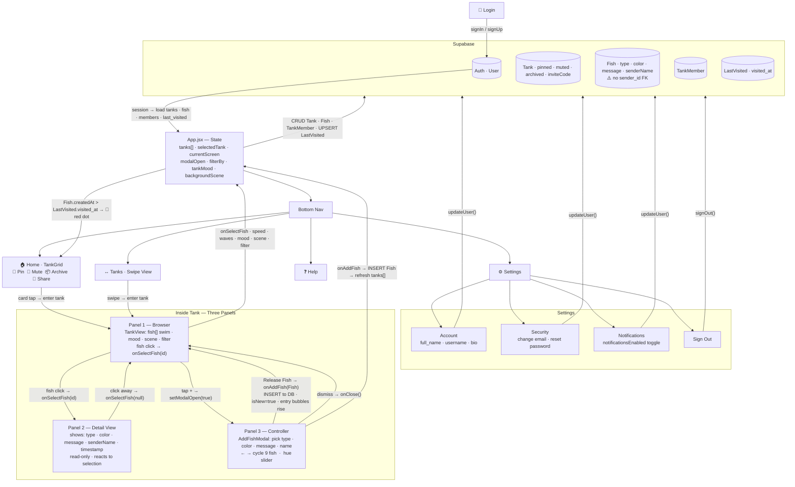

# Tide Lines

A shared fish tank messaging app for international students and diaspora families. Each fish is a message from someone you love. Built with React + Vite, hosted on GitHub Pages.

**Live site:** https://akezi4h-dev.github.io/Fish-Tank/

---

## Design Intent

### Personal Statement

As an international student, distance is what brings my friends and family closer and apart. With busy schedules it's hard to keep in contact with what's going on in our lives. My goal is to create a fish tank that displays messages of different people. The way it will work is that users can go to a group tank where there will be fishes that enter the tank and you can add a fish. Through this you can see different messages by hovering over the fish. This creates connection through different families and friends.

For international students and diaspora families, staying connected across time zones is emotionally real but logistically hard. **Tide Lines** is a shared aquarium where each fish is a message from a person you love. The tank is always alive — new fish enter, swim freely, and carry their sender's words. Connection feels ambient, not obligatory.

**Target audience:** Gen Z, Gen Alpha, and Millennials in long distance relationships with family, friends, and partners.

The fish metaphor earns its domain — messages accumulate like a living reef. Unlike a group chat, you browse at your own pace. Unlike social media, there is no feed, no algorithm — just fish.

---

### Visual Mood

**Deep ocean — dark, atmospheric, bioluminescent**

| Element | Value |
|---|---|
| Backgrounds | Deep navy |
| Accents | Bioluminescent teal / aqua |
| Fish | Warm coral / amber |
| Hover states | Soft lavender |
| Space | Generous negative space |
| Glow | Fish only |

**Typographic Hierarchy Patrick Hands**

| Level | Role | Style |
|---|---|---|
| Display / Hero | App name, tank name | Large, weighted — commands the space |
| Body | Fish messages, sender names | Readable at small sizes, warm not clinical |
| UI labels | Buttons, timestamps, filters | Small, quiet — never competes with content |
| Typeface intent | Monospace or rounded sans | Monospace for a technical-poetic feel; rounded sans as warmer fallback |

The tank should feel alive but unhurried — fish drift with subtle CSS animation. Clicking a fish should feel like reaching into water: a gentle pause before the Detail View reveals the message. The Controller should feel like crafting something, not filling out a form. Releasing your fish into the tank is the moment of emotional payoff — it should animate in from the edge.

---

### Three-Panel Structure

| Panel | Role | Data access |
|---|---|---|
| 🔍 **Browser — the tank** | The shared aquarium. All fish swim here. Maps over `fish[]`. On click → sets `selectedFish`. | reads + writes selection |
| 📖 **Detail View — fish profile** | Full message, sender, timestamp, appearance. Receives `selectedFish` as prop. Reacts, never initiates. | reads only |
| 🎨 **Controller — add your fish** | Write message, customize, release to tank. On submit → appends new fish object to `fish[]` in parent state. | reads + writes `fish[]` |

**Architectural rule:** No component holds its own copy of fish data. State lives only in the parent. Props down, events up.

---

### State Flow

```
User clicks fish
  → Browser calls onSelect(id)
  → Parent updates selectedFish
  → Detail View re-renders

User submits Controller
  → Parent calls setFish([...fish, newFish])
  → Browser adds new fish to tank
```

---

### Fish Customization Fields *(Controller)*

- Your name
- Message text
- Fish type
- Body color
- Pattern — solid / stripes / spots / gradient
- Fin style — flowy / spiky / small / fan

---

### Data Shape

```json
{
  "selectedFish": "fish-03",
  "fish": [
    {
      "id": "fish-03",
      "senderName": "Mom",
      "message": "Miss you! Eat something warm today.",
      "color": "#f4a261",
      "pattern": "stripes",
      "timestamp": "2026-04-18"
    }
  ],
  "filterBy": "all"
}
```

---

## Design Intent 2 — Updated

This documents the evolved design intent after the app expanded to include Supabase auth, live data, multi-tank support, and a full visual system. Every rule below was written to evaluate AI output against before implementation.

---

### Domain (Unchanged)

Tide Lines remains a shared aquarium where each fish is a message from someone you love. The emotional core — ambient connection, no feed, no algorithm — does not change. What changes is scale: multiple tanks, multiple users, real persistence, and a full UI system around the living tank.

---

### Visual System — Updated Color Rules

The original intent was all-dark. The updated system splits: **UI screens are light, the tank is always dark.** This preserves the underwater atmosphere where it matters and makes forms and navigation readable everywhere else.

| Context | Background | Text | Accent | Border |
|---|---|---|---|---|
| UI screens (Home, Settings, Help) | `#F8F7FF` warm white | `#211E4A` deep navy | `#1d9e75` teal | `rgba(33,30,74,0.12)` |
| Tank container | Scene-based (see below) | `#ffffff` | `#7fffd4` aquamarine | — |
| Nav pill (both screens) | Scene-matched frosted glass | `rgba(255,255,255,0.55)` inactive · `#fff` active | `#1d9e75` active pill | `rgba(255,255,255,0.1)` |
| Detail bubble (fish popup) | `rgba(6,26,46,0.92)` | `#e0f4f4` | `#7fffd4` sender name | `rgba(127,255,212,0.35)` |
| Add Fish modal | `#F8F7FF` | `#211E4A` | `#1d9e75` | `rgba(33,30,74,0.12)` |
| Login screen | Full-viewport dark carousel + frosted glass card | `#ffffff` card | `#1d9e75` button | — |

**Typographic update:** `pt-serif` (Adobe Typekit) replaced monospace/rounded-sans. The literary quality matches the emotional register — messages between people should feel like correspondence, not UI copy.

---

### Background Scenes

Each tank can be set to one of three scenes. The scene controls the background image and the color of both the header bar and the bottom nav — they always match each other. Day/night mood further shifts the bars darker.

| Scene | Background image | Day bar color | Night bar color | Mood |
|---|---|---|---|---|
| Sea | `sea.png` — deep ocean blues | `rgba(26,74,107,0.92)` | `rgba(10,31,48,0.95)` | Open water, bioluminescent |
| Jungle | `jungle.png` — teal-to-forest | `rgba(26,42,26,0.92)` | `rgba(10,18,10,0.95)` | Dense, warm, overgrown |
| Deep | `deep.png` — near-black abyss | `rgba(2,12,31,0.92)` | `rgba(1,8,16,0.95)` | Pressure, silence, deep sea |

The scene and mood are stored in `App.jsx` as `backgroundScene` and `tankMood`. Both are passed into `TankView` as props. No tank component owns this state.

---

### Fish Types

9 custom SVG species, each imported from `src/assets/fish/`. Color is applied as a CSS `hue-rotate(Ndeg)` filter on top of the artwork — the slider maps 0–360°.

| Type | File | Character |
|---|---|---|
| Clownfish | `Clownfish.svg` | Warm, recognisable, orange base |
| Angelfish | `Angel Fish.svg` | Tall fins, elegant silhouette |
| Eel | `Eel.svg` | Long, sinuous, unexpected |
| Lionfish | `Lion Fish.svg` | Dramatic spines, statement fish |
| Otter | `Otter.svg` | Playful, soft — breaks the reef pattern |
| Pufferfish | `Puffer Fish.svg` | Round, compact, endearing |
| Seal | `Seal.svg` | Gentle, rounded, warm |
| Shark | `Shark.svg` | Sleek, bold, directional |
| Turtle | `Turtle.svg` | Slow, steady, patient |

Fish size: **200px wide**. Each fish is a presence in the tank, not a decorative element.

---

### Three-Panel Interaction — Updated

| Panel | Component | Visual rules | What it reads | What it writes |
|---|---|---|---|---|
| **Panel 1 — Browser** | `TankView.jsx` | Dark scene background · fish swim via CSS keyframes · scene-matched header + nav · day/night mood filter | `fish[]` · `selectedFish` · `waterSpeed` · `waveIntensity` · `tankMood` · `backgroundScene` · `filterBy` — all from props | Calls `onSelectFish(id)` · `setWaterSpeed` · `setWaveIntensity` · `toggleMood` · `setScene` · `onFilterChange` |
| **Panel 2 — Detail View** | `DetailBubble` inside `TankView` | Frosted dark bubble · teal sender name · `#e0f4f4` message text · appears at click coordinates | `selectedFish` prop → resolves to Fish object | Nothing — read only. Dismisses when tank background is clicked, calling `onSelectFish(null)` |
| **Panel 3 — Controller** | `AddFishModal.jsx` | Light `#F8F7FF` modal · fish type cycler (← →) · `hue-rotate` color slider · message + name fields · teal Release button | Nothing from tank state | Calls `onAddFish(Fish)` → parent INSERTs to Supabase → fish arrives with `isNew: true` + `enterFrom: 'left'/'right'` → entry animation + rising bubbles |

**Panel interaction triggers:**

| Trigger | Source panel | Effect |
|---|---|---|
| Click fish | Panel 1 | `onSelectFish(id)` → parent sets `selectedFish` → Panel 2 renders at click position |
| Click tank background | Panel 1 | `onSelectFish(null)` → Panel 2 dismisses |
| Tap `+` in nav | Panel 1 | `setModalOpen(true)` → Panel 3 opens |
| Release Fish | Panel 3 | `onAddFish(Fish)` → Supabase INSERT → fish enters Panel 1 from screen edge with bubble burst |
| Dismiss modal | Panel 3 | `onClose()` → `modalOpen = false` → Panel 3 unmounts |
| Click any fish | Panel 1 | Rising `ClickBubbles` spawn at exact click coordinates |
| Hover fish (desktop) | Panel 1 | Local `hoveredFishId` state → Panel 2 preview — does not touch parent state |

---

### Single Source of Truth — Supabase + App.jsx

The original rule was "state lives only in the parent." With Supabase, that rule extends: **the database is the authoritative record; App.jsx is the authoritative runtime mirror.** No component fetches its own data. All reads come from props. All writes go through App.jsx handlers which call Supabase and re-derive state from the response.

**Database schema:**

| Table | Key fields | RLS rule |
|---|---|---|
| `auth.users` | `id` · `email` · `user_metadata { full_name, username, bio, notificationsEnabled }` | Managed by Supabase Auth |
| `tanks` | `id` · `name` · `owner_id` · `pinned` · `muted` · `archived` · `invite_code` | Owner + members can read; owner can write |
| `fish` | `id` · `tank_id` · `type` · `color` · `message` · `sender_name` · `created_at` | Tank members can read + insert |
| `tank_members` | `tank_id` · `user_id` | Members can read own rows |
| `last_visited` | `user_id` · `tank_id` · `visited_at` | Owner only — UPSERT on every tank open |

**State flow with Supabase:**

```
Login
  → Supabase signIn/signUp → session stored in localStorage
  → onAuthStateChange fires → App.jsx calls loadTanks()

loadTanks()
  → parallel queries: SELECT tanks · SELECT fish · SELECT tank_members · SELECT last_visited
  → computes hasNotification per tank: Fish.created_at > last_visited.visited_at
  → sets tanks[] in App.jsx state → passed down as props

User opens tank
  → selectTank(id) → UPSERT last_visited → red dot clears in local state immediately

User adds fish  (Panel 3 → Panel 1)
  → onAddFish(Fish) → INSERT to fish table
  → loadTanks() re-runs → new fish gets isNew: true, enterFrom: random
  → fish animates in from screen edge · entry bubbles rise
  → red dot appears on tank card for all other members

User updates settings
  → updateUser({ data: { full_name, username, bio } }) → saved to Supabase user_metadata
  → notificationsEnabled toggle → updateUser({ data: { notificationsEnabled } })

Sign out
  → supabase.auth.signOut() → session cleared → App returns to Login
```

**Runtime data shape (App.jsx state):**

```json
{
  "currentScreen": "tank",
  "selectedTank": "tank-uuid-01",
  "modalOpen": false,
  "tankMood": "day",
  "backgroundScene": "sea",
  "waterSpeed": 1,
  "waveIntensity": 1,
  "filterBy": { "sender": "all" },
  "selectedFish": "fish-uuid-03",
  "tanks": [
    {
      "id": "tank-uuid-01",
      "name": "Family",
      "owner_id": "user-uuid",
      "pinned": true,
      "muted": false,
      "archived": false,
      "invite_code": "abc123",
      "hasNotification": true,
      "fish": [
        {
          "id": "fish-uuid-03",
          "tank_id": "tank-uuid-01",
          "type": "clownfish",
          "color": 42,
          "message": "Miss you! Eat something warm today.",
          "sender_name": "Mom",
          "created_at": "2026-04-18T14:22:00Z",
          "isNew": false,
          "enterFrom": "left"
        }
      ]
    }
  ]
}
```

---


---

## Architecture



---

## AI 201 — ESF Documentation

### AI Direction Log

**Project:** Tide Lines — AI 201 Project 2
**Format:** Each entry names the prompt given, what AI produced, what was changed, and why.

---

#### Entry 1 — Domain & Concept Direction

**Session:** Project kickoff
**What I asked:** I told Claude the domain was "my github repo" before clarifying. When I clarified, I said I was going to write a design intent document tonight.
**What AI did:** Claude correctly paused and waited. It did not generate a domain concept on its own or try to interpret "my GitHub repo" as a theme. It asked clarifying questions: was it a portfolio viewer of my repos, or something about this specific repo?
**What I did instead:** I came back with a fully personal design intent — *Tide Lines*, a shared fish tank where each fish is a message from someone you love, rooted in my experience as an international student. The fish metaphor came from me, the name "Tide Lines" came from me, the emotional framing ("connection feels ambient, not obligatory") came from me.
**Why it matters:** The assignment says to be the Art Director of a system. I didn't let AI generate the concept. The domain is personal and specific to my life — AI couldn't have invented it.

---

#### Entry 2 — Build Order Enforcement

**Session:** After design intent was submitted
**What I asked:** I gave Claude the full spec and said: *"Build it one component at a time, starting with the data model and parent state."*
**What AI produced:** Claude built only the parent App component with the full useState shape and mock data — no UI, no components, just state and handlers. It explicitly returned `null` from the render.
**What I did:** I approved this and said "yes" to proceed to Screen 1.
**Why it matters:** The assignment explicitly warns that AI will try to build all three panels at once and make architectural decisions you didn't approve. I enforced the build order: parent state → Screen 1 → Screen 2 → Screen 3. Each step required my explicit go-ahead. Claude did not deviate from this sequence.

---

#### Entry 3 — Fish Type Connection (Caught and Directed)

**Session:** After all three screens were built
**What AI produced:** Claude built `TankView.jsx` with its own internal `FishSVG({ color })` component that rendered a single hardcoded generic fish shape — an ellipse + triangle tail + eye. The `fish.type` field from state was passed into the fish object but was never read in the tank renderer. Every fish in Screen 2 looked identical regardless of type.
**What I asked Claude to show me:** *"Show me where in the code the fish type from state is being used to determine what renders in the tank. If it's not connected, fix it."*
**What I directed:** I caught the disconnection and directed Claude to extract all fish shapes into a shared `FishSVGs.jsx` file, export a single `FishSVG` component that takes both `type` and `color` as props, and use it in both TankView and AddFishModal. Both screens now import from the same source.
**Why it matters:** This is the exact failure mode the assignment warns about — AI builds something that looks connected but the data isn't actually flowing. `fish.type` was in state. It just wasn't being read. I caught it and directed the architectural fix.

---

#### Entry 4 — Custom Artwork Over AI-Generated SVGs

**Session:** After fish type fix
**What AI produced:** Claude had generated five hand-coded SVG fish (clownfish, angelfish, betta, goldfish, pufferfish) using basic geometric shapes — ellipses, polygons, lines. They were functional but generic. The AI designed them from scratch with no reference to my visual intent.
**What I did:** I had my own custom SVG artwork in the repo folder (`Untitled (4)/`): Angel Fish, Clownfish, Eel, Lion Fish, Otter, Puffer Fish, Seal, Shark, Turtle — 9 files. I directed Claude to replace the AI-generated SVGs entirely with my artwork.
**What changed:** The AI's geometric fish shapes were deleted. All 9 custom files were moved to `src/assets/fish/`, imported into `FishSVGs.jsx`, and the `FishSVG` component was rewritten to render `` tags pointing to my files. The color slider still applies `hue-rotate` on top of the real artwork.
**Why it matters:** Visual direction is mine. AI generated placeholder shapes because it had nothing else to work with. When I had real assets, I replaced the placeholders. The final app reflects my artwork, not Claude's geometric approximations.

---

#### Entry 5 — Expanding Fish Types (9 vs 5)

**Session:** Same session as custom artwork
**What AI assumed:** The original spec and the AddFishModal were built for exactly 5 fish types — clownfish, angelfish, betta, goldfish, pufferfish — matching the spec I provided.
**What I directed:** When I brought in my custom SVG folder, I had 9 files, not 5. I explicitly asked: *"can i add all the images and the types to the modal selector."* I directed expanding FISH_TYPES from 5 to all 9: clownfish, angelfish, eel, lionfish, otter, pufferfish, seal, shark, turtle.
**What changed:** `FISH_TYPES` array in `FishSVGs.jsx` expanded. The modal selector now arrows through all 9. The tank can render all 9 types.
**Why it matters:** The final creative scope of the species in the tank is my decision. AI had no knowledge of the Otter, Seal, Shark, Turtle, or Eel until I surfaced the files. I defined what belongs in this tank.

---

#### Entry 6 — Replacing Caustic Rays with Sine Wave Water Effect

**Session:** After all three screens were complete and deployed
**What AI produced:** Claude implemented a water effect with three layers: caustic light rays (diagonal SVG rectangles spanning the tank), a surface shimmer band, and floating particles. The caustic layer rendered as large diagonal stripe shapes overlaid across the tank.
**What I rejected:** The diagonal stripes looked wrong — they obscured the tank background instead of enhancing it. I directed Claude to remove the caustic rays entirely.
**What I directed:** I gave Claude a full replacement spec: horizontal SVG sine wave paths only, no diagonal shapes, nothing that blocks the tank background. I specified the technique — cubic bezier sine paths, separate X drift and Y undulation on two different elements — and the visual parameters: 3 waves at different depths, thin strokes at very low opacity, subtle particles, minimal surface shimmer.
**Why it matters:** The water effect is an atmospheric layer. I defined what atmospheric means for this project: horizontal, subtle, background-visible. When AI produced something that contradicted that, I caught it visually, described exactly what was wrong, and gave a precise replacement directive. The final effect looks like water because I directed it to look like water.

---

#### Entry 7 — Connecting Wave Slider to WaterEffect Speed

**Session:** Continued session after water effect rewrite
**What AI produced:** The WaterEffect component used hardcoded animation durations. The Waves slider controlled fish swim speed but wave animation speed was static — sliding the control did nothing to the wave lines themselves.
**What I directed:** I asked for the wave slider to make the waves faster when moved to the right. I directed Claude to pass `waveIntensity` as a `speed` prop into `WaterEffect` and divide each wave's animation durations by that value.
**What changed:** `WaterEffect` now accepts `speed={waveIntensity}` from `TankView`. Both X and Y durations are divided by `speed` at render time. Moving the slider right increases speed across all three wave lines simultaneously.
**Why it matters:** The slider was already wired to fish speed. Extending it to wave speed makes the control feel complete — everything in the tank responds to the same input. I identified the gap and directed the fix.

---

#### Entry 8 — Enlarging Tank Cards on Screen 1

**Session:** Continued session
**What AI produced:** The TankGrid used a `maxWidth: 800px` container with small gaps. The tank cards were functional but small relative to the available screen space.
**What I directed:** I asked for the tanks to be bigger on the first screen. I directed Claude to widen the grid to `maxWidth: 1100px` and increase column gaps to 32px.
**Why it matters:** Layout scale is a visual direction decision. The cards are the primary UI element on Screen 1 — they should read as fish tanks, not thumbnails. Widening the grid gives the preview fish more room and makes the emotional content of each tank more legible at a glance.

---

#### Entry 9 — Tank Management Buttons (Pin, Invite, Mute, Archive)

**Session:** New session
**What I directed:** I specified four new circular icon buttons beneath each tank card on Screen 1 — pin, invite, mute, and archive — each with its own behavior and state toggle. I defined the state architecture: all booleans (`pinned`, `muted`, `archived`) live on the tank object in parent state, invite modal state also lives in the parent, and cards call callbacks only.
**What changed:** `App.jsx` got four new handlers and two new state fields. A new `InviteModal.jsx` was created. `TankGrid.jsx` was updated with the button row, pin sort logic, and archived filter with a "show archived" toggle.
**Why it matters:** Four separate features, all controlled from parent state. I specified that the invite modal must render at the app level — not inside the card — which prevents the modal from being trapped inside a button's stacking context.

---

#### Entry 10 — Full Responsive Layout

**Session:** Continued session
**What I directed:** A detailed spec for responsive behavior across all screens: 3-column desktop, 2-column tablet, 1-column mobile. Bottom sheet panels for mobile nav, larger touch targets, smaller title font, modal height limits. CSS media queries only — no external libraries.
**What changed:** Grid layout properties moved from inline styles to CSS classes (required because media queries cannot override inline styles). Media queries added to `TankGrid.css`, `TankView.css`, `AddFishModal.css`, and new `InviteModal.css`.
**Why it matters:** I defined the exact layout behavior at each breakpoint. The bottom sheet behavior for nav panels was a specific interaction decision — panels should feel native on mobile, not like floating cards scaled down.

---

#### Entry 11 — Click-to-Stop Fish Interaction + Separated Hover State

**Session:** Continued session
**What I directed:** Two-mode fish interaction: hover (desktop only, existing behavior preserved) and click/tap (stops the fish in place, locks the bubble). Local `hoveredFishId` inside TankView for hover only; parent `selectedFish` for the stopped state only. Clicking the tank background dismisses the stopped fish.
**What changed:** `TankView.jsx` gained local `hoveredFishId` state. Hover handlers were decoupled from `onSelectFish`. New `handleFishClick` and `handleTankClick` added. Stopped fish get `animationPlayState: 'paused'` and `.fish-stopped` CSS glow class.
**Why it matters:** The original code conflated hover and selected into one parent state value. I directed the split: hover is local and visual, stopped is shared state. This distinction is essential for mobile where there is no hover.

---

#### Entry 12 — Tank Title Centered

**Session:** Continued session
**What I directed:** Tank title in Screen 2 header should be truly centered relative to the full bar width, not offset after the back button. Directed `position: absolute; left: 50%; transform: translateX(-50%)`.
**Why it matters:** "Centered" in a flex row after a left-aligned button is not actually centered. I specified the correct technique.

---

#### Entry 13 — Fish Size Direction (200px)

**Session:** Continued session
**What AI defaulted to:** Fish at 70px — conservative, safe, fits multiple fish without overlap.
**What I directed:** 1.5x (105px), then decided 200px. Each fish is a message from someone you love — they should feel substantial, not small.
**Why it matters:** Fish size is a visual direction decision. The default was chosen by AI for safe layout. I overrode it twice to arrive at a size that matches the emotional weight the fish are supposed to carry.

---

#### Entry 14 — Supabase Auth & Full Data Integration

**Session:** New session after visual build was complete
**What I directed:** I asked Claude to connect Supabase to the project and walk through auth, live data, and all CRUD operations. I provided the project URL and anon key, specified the exact table schema (tanks, fish, tank_members with invite_code), wrote the RLS SQL myself in the Supabase editor, and approved each step before it was wired into the app.
**What changed:** `supabaseClient.js` was created. `LoginScreen.jsx` was rewritten with real `signInWithPassword` / `signUp` calls. `App.jsx` replaced all mock data with live Supabase queries — `loadTanks`, `addFish`, `addTank`, `joinTank` — and auth state was wired via `getSession` + `onAuthStateChange`.
**Why it matters:** The move from mock data to live Supabase was a deliberate architectural decision I directed step by step. I chose the schema, wrote the SQL, set the RLS policies. AI connected the wiring I designed — it didn't design the database.

---

#### Entry 15 — RLS Debugging and Policy Repair

**Session:** Continued Supabase integration session
**What happened:** After connecting Supabase, `addTank` returned a 403 RLS error. Claude traced the root cause to the wrong anon key format (`sb_publishable_` prefix doesn't attach the JWT to requests, so `auth.uid()` returns null). A second round of debugging found that the `tanks` table had zero RLS policies. A third issue: the `tank_members` SELECT policy was missing, and `fish` had no policies at all.
**What I directed:** I ran diagnostic SQL in the Supabase editor at Claude's direction, confirmed the policy gaps, and approved each `CREATE POLICY` block before it was run. I also directed a `join_tank_by_invite` RPC to solve the chicken-and-egg problem: a new user can't SELECT from `tanks` to find a tank by invite code because they're not yet a member — but they need to find the tank to become a member. The RPC runs with `SECURITY DEFINER` to bypass RLS for the lookup only.
**Why it matters:** Every RLS policy in this database was deliberately reviewed and approved by me. I caught the gaps by running diagnostic queries, not by guessing. The RPC solution was a real architectural decision about where to break the RLS boundary safely.

---

#### Entry 16 — Red Notification Dot Architecture

**Session:** After Supabase integration was stable
**What I directed:** I specified a full notification system: a `last_visited` table tracking when each user last opened each tank, an upsert on every tank open, and `hasNotification` computed in the parent from Supabase data and passed down to each card as a prop. I explicitly ruled out the card fetching its own data or computing its own notification state.
**What changed:** `last_visited` table and RLS were created in Supabase. `loadTanks` gained a third parallel query for visited timestamps, then computed `hasNotification` per tank. `selectTank` became async and fire-and-forgets an upsert while immediately clearing the dot in local state. `TankGrid` renders a 10px red circle absolutely positioned top-right only when `tank.hasNotification` is true.
**Why it matters:** I specified the state rule explicitly: `hasNotification` is a derived value computed in the parent, not fetched by the card. This is the same props-down/events-up principle enforced throughout the app.

---

#### Entry 17 — Login Screen Redesign: Carousel + Frosted Glass

**Session:** After notification dot feature
**What I directed:** I gave a full redesign spec for the login screen: a full-viewport carousel of animated tank previews as a background layer, and the login form as a frosted glass card floating on top. I specified the exact structural layering — carousel as `position: absolute` background, form as `position: relative` centered by the flex root. I specified the frosted glass treatment (`backdrop-filter: blur(12px)`, dark translucent background, `border-radius: 24px`), the teal button color (`#1d9e75`), and the Join Tank row beneath the auth buttons.
**What changed:** `LoginScreen.jsx` was completely rewritten with a `Carousel` component rendering mock tank data via the existing `TankPreview` component exported from `TankGrid.jsx`. `LoginScreen.css` was rebuilt from scratch.
**Why it matters:** The original login screen was a plain dark card. The redesign communicates the product before login — you see fish tanks in motion before you even sign in. That's a deliberate product direction decision I specified completely.

---

#### Entry 18 — Carousel: From Snap Navigation to Infinite Ambient Scroll

**Session:** Continued login redesign
**What I rejected:** The first carousel implementation used index-based snap navigation with auto-advance (setInterval), left/right arrow buttons, and per-card opacity/scale that dimmed non-centered cards.
**What I directed:** I replaced the entire logic with a continuous infinite scroll — no arrows, no index state, no timers. The card array is rendered twice back-to-back, and a single CSS keyframe (`translateX(0)` to `translateX(-50%)`) loops infinitely at 40s linear. I also directed the final card size (260×380px), larger fish inside the previews (65×46px), and removal of the tank name labels below each card.
**Why it matters:** The carousel isn't a navigation element on the login screen — it's atmosphere. Interactive navigation implies the cards are meaningful destinations before login, which they aren't. An ambient drift reads as environmental backdrop, not UI chrome.

---

#### Entry 19 — Session Persistence, Welcome Message, and First Name Signup

**Session:** New session
**What I directed:** I specified three connected features: persistent login using Supabase's localStorage session, a welcome message on Screen 1 showing the user's first name, and a first name prompt added to the signup flow that stores `full_name` in Supabase `user_metadata`.
**What changed:** The `authLoading` null return was replaced with a teal "Tide Lines" loading screen so the login screen never flashes on return visits. `App.jsx` derives `firstName` from `user_metadata.full_name` or falls back to the email prefix. `TankGrid` receives `userName` and shows "Welcome back, / [name]". `LoginScreen` gained `showFirstName` state — clicking Sign up once reveals the first name field, clicking again completes registration.
**Why it matters:** These three features are connected by one product principle: the app should feel like it knows you. The welcome message is the payoff of storing the name at signup. I specified the full chain — collection → storage → display — and the exact fallback logic for users who signed up before the name field existed.

---

#### Entry 20 — Persistent Bottom Navigation Bar

**Session:** Continued session
**What I directed:** I gave a full spec for a persistent bottom nav bar — a floating pill-shaped bar where the active button expands into a labeled pill. I specified 4 tabs: Home, Tanks, Settings, Help. Bar style: frosted glass pill, `rgba(4,16,30,0.9)`, `backdrop-filter: blur(12px)`. Inactive: icon only, 45% opacity. Active: teal pill, icon + label, `0.3s ease` transition. State rule: `currentScreen` lives in the parent, nav reads it as a prop and calls `onNavigate`.
**What changed:** `BottomNav.jsx` and `BottomNav.css` were created. `SettingsScreen.jsx` created with display name, change email, password reset, and sign out. `HelpScreen.jsx` created with 4 content sections. `App.jsx` gained `currentScreen` state and routing. `BottomNav` is hidden when in the swipeable tanks experience.
**Why it matters:** The navigation architecture was mine to define. I specified which features belong in the nav, which don't, and how state should flow. The active pill animation was a specific visual direction decision.

---

#### Entry 21 — Tanks Nav: List View Rejected, Swipeable Experience Directed

**Session:** Continued session
**What AI built first:** The Tanks tab rendered a flat list — tank name, fish count, notification dot, tap to open. Functional but passive.
**What I directed:** I replaced the list entirely with a full-screen swipeable tank experience. Tapping Tanks takes you directly into a TankView with fish swimming and you swipe left/right to move between tanks. Dot indicators at the top show position. I specified the state architecture: `swipeTankIndex` in parent, touch detection via delta > 50px, keyboard arrow key support, and `translateX` CSS transition with both tanks visible simultaneously during the slide.
**What changed:** `TankListView.jsx` replaced by `SwipeTankView.jsx`. Touch events use native capture-phase listeners so child elements can't block them. `addFish` updated to accept an explicit `tankId` parameter for swipe mode.
**Why it matters:** A list of tanks is a utility screen. A swipeable tank view is an experience. The product direction is that tanks are living spaces you move through, not items in a directory.

---

#### Entry 22 — Login Screen Title Hierarchy

**Session:** Continued session
**What I directed:** I asked to add a large "Tide Lines" title at the top of the login screen and a "Sign up" label inside the card.
**What changed:** A `.login-hero-title` element was added absolutely positioned at the top of the full viewport (`top: 36px`, `3.2rem`, teal with soft text shadow). The card's internal title reads "Sign up" at a smaller weight. Two headings, two purposes.
**Why it matters:** Hierarchy is a visual direction decision. The hero title is branding — it belongs to the whole screen. The card title is a form label — it belongs to the interaction.

---

#### Entry 23 — Fish Entrance Animation and Entry Bubbles

**Session:** New session
**What I directed:** When a new fish is added via the modal, animate it sliding in from a random screen edge with a cluster of rising bubbles at the entry point. I specified `isNew` and `enterFrom` flags on the fish object in parent state, a `useEffect` keyed on a derived `newFishIds` string to clear flags after 2500ms, CSS keyframes for left/right entry, and an `EntryBubbles` component using lazy `useState` initializer for stable randomised bubble data with `onAnimationEnd` self-cleanup.
**Why it matters:** The entrance animation makes a new message feel like an event. The lazy initializer pattern ensures bubble randomness is stable across re-renders. The derived string dependency prevents infinite re-render loops when clearing the `isNew` flag.

---

#### Entry 24 — Rising Bubbles on Fish Click

**Session:** Continued session
**What I directed:** When a fish is clicked, release a rising bubble cluster from the exact click point. I specified `getBoundingClientRect()` for tank-relative coordinates, `Date.now()` keys so rapid clicks produce independent clouds, and a `ClickBubbles` component that calls `onDone` when all bubbles finish animating.
**Why it matters:** The click needed a physical response. Bubbles rising from where you touch reads as tactile — you disturbed the water. Independent keys per click set means no race conditions between overlapping animations.

---

#### Entry 25 — Font Switch to Adobe Typekit pt-serif

**Session:** Continued session
**What I directed:** Replace Patrick Hand (Google Fonts) with `pt-serif` via Adobe Typekit. I provided the exact `<link>` tag.
**Why it matters:** Typography is a visual direction decision. pt-serif gives the app a literary quality that matches the emotional register of Tide Lines — messages between people should feel like correspondence.

---

#### Entry 26 — Full Light Color Scheme Across All Screens

**Session:** Continued session
**What I directed:** A complete overhaul to `#F8F7FF` background, `#211E4A` navy text, `rgba(33,30,74,…)` borders, `#1d9e75` teal accent — applied across login, panels, modals, header, nav, and home screen. I specified scoping the light background to `.grid-page` so the tank view stays dark.
**Why it matters:** The light scheme reads warmer and more personal than generic dark-mode UI. Scoping it to the class rather than body was a deliberate architectural decision to preserve the underwater darkness of the tank itself.

---

#### Entry 27 — Scene-Based Dynamic Bar Colors with Night Mode

**Session:** Continued session
**What I directed:** The header and bottom nav in the tank view change color per scene (`sea`, `jungle`, `deep`) with separate darker `night` tones. Both bars always read from the same `sceneTheme[backgroundScene][tankMood]` value — a matched pair. Transitions at `0.4s ease`.
**Why it matters:** The bars are part of the tank environment, not floating chrome. Having them match each other and respond to the scene reinforces the spatial metaphor of being inside a specific underwater place.

---

#### Entry 28 — Fish Click Glow: Drop-Shadow on Fish Silhouette

**Session:** Continued session
**What I directed:** Remove the white box-shadow halo on clicked fish and replace with layered `drop-shadow` filters that trace the actual fish silhouette.
**Why it matters:** `box-shadow` glows around the rectangular bounding box. `drop-shadow` follows the pixel content of the artwork. The effect should feel like the fish is emitting light, not like a UI selection rectangle.

---

#### Entry 29 — Settings Screen Dashboard Redesign

**Session:** New session
**What I directed:** A full two-panel dashboard layout: 220px sidebar with logo, initials avatar, nav links (Account / Security / Notifications), Sign Out in coral red; main content panel with three tabs — Account (two-column form grid), Security (email + password reset), Notifications (toggle stored in `user_metadata`). Mobile collapses sidebar to a horizontal icon strip.
**Why it matters:** The original settings screen was a single column of form fields. The dashboard layout gives each concern its own room and matches the intentionality of the rest of the app.

---

#### Entry 30 — Unified navBarStyle: Single Source of Truth for Both Nav Pills

**Session:** Continued session
**What I directed:** Extract a single `navBarStyle` JS object defining every shared nav pill property and spread it into both `BottomNav.jsx` and `TankView.jsx`. Each component overrides only `background`. Strip container rules from both CSS files. Align all icon colors: `rgba(255,255,255,0.55)` inactive, `#ffffff` active.
**Why it matters:** Two CSS files defined "the same" styles separately and kept diverging. A shared constant is the only structural guarantee of consistency — the same single-source-of-truth principle applied to design tokens.

---

#### Entry 31 — Netflix-Style Avatar Picker Replacing File Upload

**Session:** New session
**What I directed:** Remove the profile photo file upload from Settings entirely and replace it with a preset avatar picker. I specified 12 ocean creatures in a 4×3 grid — crab, octopus, shark, clownfish, whale, turtle, pufferfish, squid, dolphin, lobster, shell, coral — each with its own background color. The selected avatar gets a teal ring and a checkmark badge. Picking one saves immediately to Supabase `user_metadata.avatar_id` with no confirm step. The avatar appears everywhere the user's identity is shown: Settings sidebar, Settings account panel, InviteModal member rows, and MembersPanel.
**What changed:** New `Avatars.jsx` with `AVATARS` array, `AvatarDisplay` component, `AvatarPickerModal` component, and `getMemberColor` for users without avatars. New `Avatars.css`. File upload removed from Settings. `AvatarDisplay` imported and used in four places across the app.
**Why it matters:** File upload meant navigating a system dialog, waiting for an upload, and dealing with storage errors. Preset avatars are instant and on-brand — ocean creatures match the fish tank metaphor. I defined the species list and the interaction model; AI built what I described.

---

#### Entry 32 — Rising Bubble Animation on Action Buttons

**Session:** Continued session
**What I directed:** When the "Release Fish" button or "Update Profile" button is clicked, spawn a cluster of 6–8 teal rising bubbles from the button's position. I specified a DOM-level approach: `document.body.appendChild` with `position: fixed` so the bubbles work regardless of stacking context or component tree depth, and Web Animations API keyframes (not CSS classes) so each bubble has independent randomised size, duration, travel distance, and wobble offset. Bubbles self-remove when their animation finishes.
**What changed:** New `src/utils/bubbleEffect.js` with `spawnBubbles(buttonEl)`. Applied to the Release Fish button in `AddFishModal.jsx` and the Update Profile button in `SettingsScreen.jsx`.
**Why it matters:** The bubble burst makes a completion action feel physical — you released something into water. The DOM-level approach avoids the limitations of CSS-injected animations and works identically from any component. I specified both the technique and the visual parameters; the util is entirely driven by my spec.

---

#### Entry 33 — Ambient Background Bubbles in Tank View

**Session:** Continued session
**What I directed:** While a tank is open and active, continuously spawn ambient bubbles rising from the tank floor — one bubble every 600–900ms (random interval), random size (4–14px), random horizontal position, 4–8 second rise duration with a lateral sway keyframe path. Bubbles fade to zero opacity at the top and self-remove via `onAnimationEnd`. The spawner uses `useEffect` with a self-rescheduling `setTimeout` (not `setInterval`) so the interval is truly random each cycle. A `mounted` flag and `clearTimeout` in the cleanup prevent ghost state updates after unmount.
**What changed:** `ambientBubbles` state array in `TankView.jsx`, spawner `useEffect`, `.ambient-bubble` CSS class with `@keyframes ambient-bubble-rise` replacing the old static bubbles array.
**Why it matters:** Static decorative bubbles were fixed in position and number. Ambient spawning makes the tank feel alive — the water is always moving, always producing something, even when there are no fish. The random interval prevents any visible rhythm that would make the animation feel mechanical.

---

#### Entry 34 — Left/Right Tank Navigation with Slide Animation

**Session:** Continued session
**What I directed:** Add left/right navigation to switch between tanks from inside a tank view. Two sets of arrows: one in the header flanking the tank name, one overlaid on the tank body that appear on hover. Navigation triggers a 350ms CSS slide animation: the outgoing tank slides out in the departure direction while the incoming tank slides in simultaneously. I specified the two-panel render pattern — `prevTank` and `currentTank` rendered as sibling `.tank-slide-panel` divs inside a `.tank-slide-wrapper`, the outgoing at z-index 1 with `pointer-events:none`, the incoming at z-index 2. Four CSS keyframes cover the four direction combinations. The `isTransitioning` flag blocks rapid input during the animation.
**What changed:** `prevTankId`, `slideDirection`, `isTransitioning` state in `App.jsx`. `navigateTank(direction)` function. Slide wrapper markup in the tank view render path. Four CSS keyframe animations in `TankView.css`. Header and body arrow buttons in `TankView.jsx` with dim state when at first or last tank.
**Why it matters:** Back-to-grid and re-selecting was the only way to switch tanks before this. The slide animation makes tanks feel physically adjacent — you travel between them, you don't navigate to them. The two-simultaneous-panel approach was a specific architectural decision: both panels must animate at the same time for the slide to feel real.

---

#### Entry 35 — Public/Private Tank Creation Modal

**Session:** Continued session
**What I directed:** Replace the `window.prompt()` that created new tanks with a proper two-step modal. Step 1: name input with a text field. Step 2: a card picker between Private (lock icon, default) and Public (wave icon). The default is always Private. I specified the card-based picker over a toggle or checkbox because the choice has product implications — public tanks are discoverable, private are invitation-only — and the two-card layout makes that weight legible.
**What changed:** New `CreateTankModal.jsx` and `CreateTankModal.css`. `TankGrid.jsx` updated to open the modal instead of calling `window.prompt`. `addTank()` in `App.jsx` updated to accept `isPublic` parameter and pass it to Supabase. `is_public` column added to the `tanks` table in Supabase.
**Why it matters:** `window.prompt()` is a browser native dialog — it breaks the visual design and has no room for additional inputs. The modal is part of the product. The two-step flow separates naming (identity) from visibility (access model), which are genuinely different decisions that deserve their own moment.

---

#### Entry 36 — Discover Tab and Placeholder Public Tanks Screen

**Session:** Continued session
**What I directed:** Add a Discover tab to the bottom nav between Tanks and Settings, with a compass rose SVG icon. The Discover screen shows a grid of public tanks that anyone can browse without being a member. For the initial version, I specified four hardcoded placeholder tanks — Midnight Reef, Sunken Kelp Forest, The Bioluminescent Bay, Coral Drift — as proof of concept for how the feature would work when connected to real public tank data.
**What changed:** `DiscoverScreen.jsx` and `DiscoverScreen.css` created. `BottomNav.jsx` updated with the Discover tab and inline compass SVG. `App.jsx` added the Discover screen routing.
**Why it matters:** Discover is a distinct product surface — it's where the app opens outward to a community beyond your personal tanks. The placeholder approach lets the UI exist and be evaluated before the backend public tank query is built. The tab ordering (Home → Tanks → Discover → Settings → Help) was deliberate: personal content before community content.

---

#### Entry 37 — Members Panel and Profile Code System

**Session:** Continued session
**What I directed:** Add a Members panel inside each tank view showing who is in the tank. Each member displays their avatar, display name, and role (owner vs member). Below the list, add a profile code lookup field: every user has a unique `TL-XXXX` code generated on first login and stored in `user_metadata`. Looking up a code shows that person's profile so they can be added to a tank. I specified the full storage chain: `generateProfileCode()` runs client-side on first load if no code exists, saves to `auth.user_metadata`, the trigger syncs it to the `profiles` table so other users can look it up. Profile codes are displayed in Settings with a one-click copy button.
**What changed:** New `MembersPanel.jsx` and `MembersPanel.css`. `generateProfileCode()` added to `App.jsx`. `profile_code` column added to `profiles` table. Supabase trigger updated to sync `avatar_id` and `profile_code`. Settings AccountPanel gained the profile code display field and copy button.
**Why it matters:** The share flow before this was invite-link only. Profile codes give users a stable, human-readable identity that works without a link — you can share it verbally, write it down, include it in a bio. It also surfaces the social layer of the app: you can see exactly who is in a tank and look up anyone by code.

---

#### Entry 38 — Discover Page Redesigned to Match Home Grid

**Session:** New session
**What I directed:** The initial Discover screen was a list view. I specified a complete redesign to make the Discover grid pixel-perfect identical to the home page tank cards — same `TankPreview` component with animated fish, same grid CSS classes, same card dimensions, same font and spacing. Clicking a card opens the full `TankView` with water effects, fish, and the add fish flow. I also specified that the Members tab should be hidden for Discover tanks since they are public and the members system is for personal tanks. I directed the header to follow the same two-line structure as the home page "Welcome back / [Name]" — "Explore some / tanks".
**What changed:** `DiscoverScreen.jsx` completely rewritten — imports `TankPreview` from `TankGrid`, renders using `grid-page` and `grid-layout` shared CSS classes, style constants copied verbatim from `TankGrid`. `TankView.jsx` gained an `isDiscover` prop that hides the Members button. Placeholder tanks given real fish data so the preview cards show actual animated fish.
**Why it matters:** A list view treats public tanks as a directory. A card grid treats them as living spaces — the same mental model as the home page. The visual consistency was not aesthetic preference; it was product direction. A user who sees the home page and then the Discover page should immediately understand what the cards are and how to interact with them because they are the same thing.

---

#### Entry 39 — Remove Members Button from Tank Toolbar

**Session:** New session
**What I directed:** Remove the people/members icon button from the bottom toolbar inside the tank view entirely. The toolbar had six buttons: filter, waves, +, brightness, scene, and members. I directed removing the members button completely across all tank views — not just for Discover tanks, but everywhere.
**What changed:** The members button JSX block removed from `TankView.jsx`. The `isDiscover` conditional guard added in an earlier session became redundant and was also cleaned up. The `MembersPanel` render path remains in the code but is no longer reachable from the UI.
**Why it matters:** The members button was adding complexity to an interaction surface that should stay focused — fish, water, and adding messages. Membership management belongs in the invite flow, not inside the tank itself.

---

#### Entry 40 — Consolidated Create Tank Form: Single Page with Three Sections

**Session:** Continued session
**What I directed:** Replace the two-step Create Tank modal (step 1: name, step 2: visibility) with a single-page form showing all sections at once. Three stacked sections: (1) "Name your tank" with a text input; (2) "Who can see it?" with Private 🔒 and Public 🌊 side-by-side selectable cards, default Private, teal border and tint on selection; (3) "Add people (optional)" with a profile code input, an Add button, and removable name chips below when valid codes are entered. A full-width solid teal "Create Tank" button at the bottom, disabled until the name field has at least one character. Header: "New Tank" in Patrick Hand 22px with an X to cancel.
**What changed:** `CreateTankModal.jsx` rewritten — no step state, all three sections rendered simultaneously. `CreateTankModal.css` rebuilt with section layout, chip styles, code input row, and solid teal primary button. `App.jsx` `addTank` updated to accept an `invitedIds` array and insert those users into `tank_members` alongside the owner on creation. Profile code lookup hits Supabase `profiles` table directly from the modal.
**Why it matters:** Two-step flows add friction for a simple decision. Showing everything on one page lets users see all the options at once and fill them in any order. The "Add people" section being optional and collapsible-by-omission means it doesn't burden users who just want to name a tank quickly.

---

#### Entry 41 — Public/Private Tank Routing and Real Tanks on Discover

**Session:** Continued session
**What I directed:** After creating a tank, the app should route to the correct destination based on visibility: public tanks land on the Discover page, private tanks stay on Home. I also directed the Discover page to show real public tanks from Supabase alongside the placeholder tanks — the user's own public tanks read from the already-loaded `tanks[]` array in App.jsx and passed down as props, not fetched separately. Clicking a real public tank on Discover opens the full App.jsx tank view (with Supabase data and fish management), while placeholder tanks continue to use local state.
**What changed:** `addTank` in App.jsx calls `setCurrentScreen('discover')` after `loadTanks` when `isPublic` is true. DiscoverScreen receives `publicTanks` and `onSelectRealTank` props. Real tanks render first in the Discover grid; clicking them calls `selectTank(id)` which hands off to App.jsx's existing tank view routing.
**Why it matters:** Without routing, a public tank would appear on the home page with private tanks — the wrong context. The single-source approach (filter the already-loaded tanks array rather than running a new query) avoids an extra Supabase round trip and keeps the data consistent with what App.jsx already knows about.

---

#### Entry 42 — Distinct Button Set for Archived Tank Cards

**Session:** Continued session
**What I directed:** Archived tank cards should show a different set of action buttons than active cards. Active cards keep all four buttons (pin, share, mute, archive) unchanged. Archived cards replace all four with just two: a 🗑️ Trash button in red (#e74c3c) and a 📦 Unarchive button. The Trash button triggers a confirmation dialog ("Are you sure you want to delete this tank?") with a red "Yes, delete" and a Cancel. Confirming shows a toast.
**What changed:** `MgmtBtn` in `TankGrid.jsx` gained a `danger` prop that applies `.mgmt-btn-danger` CSS (red color, red border). `TrashIcon` SVG added. The mgmt-row conditionally renders the two-button archived set or the four-button active set based on `tank.archived`. Confirmation dialog and toast state added to `TankGrid`. `confirmStyles` object added for the dialog and toast.
**Why it matters:** Showing pin, share, and mute on an archived tank is confusing — those actions have no meaning on a tank you've put away. The simplified archived button set communicates clearly what you can do: restore it or permanently delete it. The red trash icon makes the destructive option visually distinct from the neutral unarchive.

---

#### Entry 43 — Real Supabase Delete with Confirmation and Error Handling

**Session:** Continued session
**What I directed:** Wire the trash button to actually delete the tank from Supabase — `supabase.from('tanks').delete().eq('id', tankId)`. On success, remove the card from local state immediately without a page refresh and show "Tank deleted" toast. On failure, keep the card visible and show "Could not delete tank — try again" in a dark red toast. The confirmation dialog added in Entry 42 fires before the Supabase call.
**What changed:** `deleteTank` function added to App.jsx. `onDeleteTank` prop added to TankGrid. `handleDeleteConfirm` made async — awaits `onDeleteTank`, then shows success or error toast based on the return value. Toast state changed from a boolean to message string + error boolean so the two cases can be styled differently.
**Why it matters:** The cosmetic placeholder delete gave false feedback — users thought they deleted a tank but it remained in the database. Real deletion with immediate local state removal means the UI stays truthful. The error path matters because RLS or connectivity failures are real possibilities and the user deserves to know the action failed.

---

#### Entry 44 — Fix Tank Navigation Arrows in Swipe View

**Session:** Continued session
**What I directed:** The left/right arrows inside the tank header and body were not working when entering a tank from the Tanks (swipe) tab. I directed connecting them: pass `tankIndex`, `tankCount`, `onPrevTank`, and `onNextTank` into TankView from SwipeTankView, wired to `goRef.current` with boundary checks so the arrows stop at the first and last tank rather than wrapping.
**What changed:** SwipeTankView's active TankView render updated to pass all four navigation props. `onPrevTank` and `onNextTank` check `swipeTankIndex` against boundaries before calling `goRef.current`.
**Why it matters:** The arrows existed in the UI but called no-op defaults because SwipeTankView never passed handlers. The fix was minimal — the infrastructure was already correct, the props were just missing.

---

#### Entry 45 — Remove Header Arrows and Dot Indicators from Tank Title

**Session:** Continued session
**What I directed:** Remove the ← → arrow buttons that flanked the tank name in the header bar, and remove the position dot indicators that appeared near the title in swipe view. Both cluttered the header without adding enough value — the hover arrows on the tank body already handle navigation.
**What changed:** The two `tank-header-arrow` buttons and the `.tank-header-center` wrapper simplified to just the `<h2>` title in `TankView.jsx`. The `.swipe-dots` div and all dot renders removed from `SwipeTankView.jsx`.
**Why it matters:** The header is the tank's identity area — it should show the name clearly. Navigation chrome in the header competed visually with the title. The body hover arrows are sufficient for navigation and appear contextually rather than permanently.

---

#### Entry 46 — New Tank Card Entrance Animation with Bubble Burst

**Session:** New session
**What I directed:** When a new tank is created on Screen 1, animate it appearing with a scale-and-fade entrance and a burst of teal bubbles rising around the card. Full spec: the card fades and scales from `opacity:0 scale(0.85)` to `opacity:1 scale(1)` over 0.6s with `ease-out`. 8–10 bubbles appear positioned around the card perimeter — each a transparent circle with `1.5px solid rgba(29,158,117,0.7)` border — rising `translateY(-100px)` combined with a random `translateX` between -40px and +40px, fading from 0.9 to 0. Each bubble has randomised size (6–16px), starting position, duration (1.2–2.5s), and delay (0–1s). Bubbles are `position:absolute` with `pointer-events:none` and self-remove via `onAnimationEnd`. I specified the full state rule: `isNew` lives on the tank object in parent state, cleared by a `setTimeout` in a `useEffect` after 2500ms using the same derived-string dependency pattern as fish `isNew`. The card component receives `isNew` as a prop — it does not own or manage that flag.
**What changed:** `App.jsx` gained a `newTankIds` derived string and `useEffect` (mirroring the fish pattern). `addTank` sets `isNew: true` on the newly created tank immediately after `loadTanks`. `TankGrid.jsx` gained a `TankNewBubbles` component using `useMemo` for stable randomised bubble data and `useState` for alive-bubble tracking via `onAnimationEnd`. The card div gets `tank-card-new` class when `isNew` is true and renders `<TankNewBubbles />` conditionally. `TankGrid.css` gained `@keyframes tank-card-enter`, `.tank-card-new`, `@keyframes tank-bubble-rise`, and `.tank-new-bubble` using `var(--dx)` for per-bubble horizontal drift set via inline style.
**Why it matters:** A tank appearing instantly with no feedback treats creation as a data operation. The entrance animation makes it feel like something was released into the world — the card materialises and the bubbles mark the moment, consistent with the underwater metaphor the whole app is built around. The `isNew` pattern mirrors the fish entrance pattern already in the codebase, so the architecture stays consistent.

---

[Full AI Direction Log →](docs/ai-direction-log.md)

---

### Records of Resistance

**Format:** Each entry names the AI output, why it was wrong or insufficient, what was done instead, and why that's better.

---

#### Resistance 1 — AI Duplicated Fish Shape Logic Across Two Components

**What AI gave me:**
When Claude built AddFishModal (Screen 3), it defined five fish SVG functions inside the modal file itself — `ClownfishSVG`, `AngelfishSVG`, `BettaSVG`, `GoldfishSVG`, `PufferfishSVG` — and used them only in the modal. Separately, TankView (Screen 2) had its own internal `FishSVG` component that was a completely different generic shape. The same concept — "render a fish" — existed in two places with two different implementations.

**Why I rejected it:**
This is exactly the duplication problem the assignment is built to teach against. The assignment's architectural rule is single source of truth. Having fish rendering logic in two places means if I change one, the other doesn't update. It also means the fish in the modal selector and the fish in the tank would never match — which is exactly what happened: users picked a clownfish in the modal and saw a generic blob in the tank.

**What I did instead:**
I directed Claude to extract all fish shapes into a single shared file, `src/components/FishSVGs.jsx`, and export one `FishSVG` component that both TankView and AddFishModal import. The fish type and color flow through props. One file. One component. Both screens use it.

**Why it's better:**
Now the fish you pick in the modal is exactly the fish that swims in the tank — because they are rendered by the same component reading from the same source. If I change a fish's look, it updates in both places automatically. The modal and the tank are now in sync by design, not by coincidence. This is what single source of truth actually means in practice.

---

#### Resistance 2 — AI Used Generic Placeholder Fish in Screen 1 Preview

**What AI gave me:**
The first version of `TankPreview` in `TankGrid.jsx` rendered an SVG tank with hardcoded generic fish shapes inside — a fixed ellipse body, polygon tail, and eye, drawn directly in the SVG using SVG coordinate transforms. These preview fish had no connection to `fish.type` or `fish.color` from state. They were decorative placeholders: every tank card showed the same orange fish regardless of what was actually in the tank.

**Why I rejected it:**
The design intent says the tank is a living preview of messages from real people. If Mom sent a clownfish and Leo sent a goldfish, the tank card on Screen 1 should show a clownfish and a goldfish — not two identical generic blobs. The preview needs to reflect actual state. Showing wrong fish breaks the user's mental model of what's inside the tank before they even open it.

**What I did instead:**
I directed Claude to replace the hardcoded SVG fish with real `FishSVG` components from `FishSVGs.jsx`, using `fish.type` and `fish.color` from `tank.fish.slice(-3)`. The preview now shows the 3 most recent actual fish at ~40% scale with idle swim animations. The Add New Tank card was explicitly kept empty — no fish, ever.

**Why it's better:**
The tank cards on Screen 1 are now truthful. You can glance at the grid and actually see whose fish are in which tank before you open it. The preview communicates real information from state instead of being decorative noise. It also means there is no redundant fish rendering code — the preview reuses the same `FishSVG` component as the full tank view, so any future artwork update is reflected everywhere at once.

---

#### Resistance 3 — AI's Generated SVG Artwork Was Not My Visual Direction

**What AI gave me:**
Before I provided my custom SVG files, Claude generated its own fish illustrations using basic SVG geometry: ellipses for bodies, polygons for tails, lines for stripes, circles for eyes. The clownfish was an orange ellipse with white stripe ellipses overlaid. The angelfish was a diamond shape. The betta was a purple ellipse with path fins. These were functional but they were AI-invented visual designs — not mine.

**Why I rejected it:**
My design intent specifies a visual mood: deep ocean, atmospheric, bioluminescent. The AI-generated fish were generic geometric approximations with no relationship to that mood or to any actual fish illustration style. More importantly, I had already created custom SVG artwork. AI did not know this artwork existed. The placeholder shapes had no place in the final product.

**What I did instead:**
I surfaced my custom artwork from `Untitled (4)/` — 9 SVG files I had designed. I directed Claude to copy them into `src/assets/fish/`, import them into `FishSVGs.jsx`, and replace the AI geometry with `` tags pointing to my files. The `hue-rotate` filter was preserved so the color slider still works on top of my artwork. Every fish the user sees in this app — in the modal, in the tank, in the preview cards — is my illustration, not Claude's.

**Why it's better:**
The app now has a consistent visual identity that matches the Tide Lines design intent. The fish have character and style — they look like illustrations, not programmer art. The hue-rotate approach means the color picker still works on top of my artwork, so I kept the functional feature without sacrificing the visual direction. AI-generated geometry would have made the app feel generic; my illustrations make it feel personal.

---

#### Resistance 4 — AI Added Diagonal Caustic Stripe Shapes That Obscured the Tank

**What AI gave me:**
When I asked for a water/light effect in Screen 2, Claude implemented a three-layer `WaterEffect` component. One of the layers was "caustic light rays" — multiple SVG rectangles rotated at steep diagonal angles, spanning the full height of the tank, with a slow drift animation. These appeared as large diagonal stripe shapes overlaid across the entire tank background.

**Why I rejected it:**
The diagonal stripes looked wrong immediately. They didn't read as underwater light — they read as angled overlays obscuring the tank. The background scene (ocean gradient, coral, deep sea) was meant to be visible through all effects. Large opaque-looking diagonal shapes across the tank contradicted that. The effect was more distracting than atmospheric.

**What I did instead:**
I directed Claude to remove the caustic rays layer entirely and rebuild the water effect from scratch using horizontal SVG sine wave paths. Three sine waves at different depths, each with its own drift speed, vertical undulation, and amplitude. The waves are subtle strokes (`strokeWidth: 1.5`, opacity 6%) that read as water lines rather than light rays. The separation of horizontal drift (X animation) and vertical undulation (Y animation) was achieved by wrapping the SVG in a parent div with independent transforms.

**Why it's better:**
The sine wave lines look like actual water. They are horizontal — which matches how water behaves physically. They are thin strokes at very low opacity, so the tank background is fully visible through them. The two-axis animation (X drift + Y undulation on separate elements) creates genuinely organic-feeling movement without interfering with each other via CSS transform conflicts. The effect adds atmosphere without competing with the fish or the background.

---

#### Resistance 5 — AI Conflated Hover and Selected Fish into One Parent State Value

**What AI gave me:**
The original fish interaction in TankView used a single `selectedFish` value in parent state for everything — when you hovered a fish, it called `onSelectFish(fishId)` to set parent state, and when you left, it called `onSelectFish(null)` to clear it. Hover and click both wrote to the same parent state field. There was no distinction between "cursor is over this fish" and "this fish is stopped."

**Why I rejected it:**
This conflation broke the design I wanted. If hover and stopped share the same state, then: moving your cursor away from a stopped fish would clear it (the `onMouseLeave` called `onSelectFish(null)`), making it impossible to keep a fish stopped. On mobile there is no hover at all, so the entire interaction model would be wrong. And parent state should not be updated on every cursor movement — hover is purely visual and local.

**What I did instead:**
I directed Claude to split the state: local `hoveredFishId` inside TankView (using `useState`) for hover only, and parent `selectedFish` for the stopped/clicked state only. Mouse enter/leave only touch local state. Click/tap only touches parent state. The bubble displays whichever is active, with stopped taking priority. The `handleTankClick` handler clears the stopped fish when the background is tapped.

**Why it's better:**
The interaction now works correctly on both desktop and mobile. Hover is fast and local — it doesn't trigger parent re-renders on every mouse enter/leave. Stopped fish stay stopped even when the cursor moves away, because the stopped state is independent of cursor position. On mobile, tap sets the stopped state directly with no hover involved. The two states can coexist — you can have a fish stopped and a different fish hovered simultaneously. The architecture matches the actual semantics of the feature.

---

#### Resistance 6 — AI Used Conservative Fish Size That Undersold the Emotional Weight

**What AI gave me:**
The fish were sized at 70px wide throughout the app — a default that ensured multiple fish could fit in view without overlap and that nothing felt crowded. It was technically safe and layout-stable.

**Why I rejected it:**
70px fish are small. In the context of Tide Lines — where each fish is a message from someone you love, possibly someone far away — small fish read as decorative background elements, not as meaningful objects. The app is built around the emotional presence of these fish. They need to feel like the main thing in the tank, not like ambient decoration.

**What I did instead:**
I directed Claude to increase the size first to 105px (1.5x), then decided that was still not bold enough and directed 200px. At 200px each fish is a significant visual presence that fills the tank meaningfully and commands attention the way a real fish in a tank does.

**Why it's better:**
The fish are the entire point of the app. At 200px they read as the primary content rather than as UI decoration. The larger size also makes the custom SVG artwork — which I drew — actually visible in detail. Small fish compress the artwork into thumbnails where the illustration quality is lost. Large fish let the artwork be seen. This was a visual direction decision, not a layout optimization.

---

#### Resistance 7 — AI Used Snap Carousel With Arrows Instead of Ambient Drift

**What AI gave me:**
The first carousel implementation was a conventional snap carousel: index state, a `setInterval` auto-advance every 4 seconds, left and right arrow buttons, per-card opacity and scale transitions dimming off-center cards, and a `translateX` offset recalculated on every index change. It looked like a standard Netflix-style content slider with interactive navigation.

**Why I rejected it:**
Arrow buttons make the carousel feel like a UI feature — something the user is supposed to interact with. On the login screen, the tank previews are not destinations. They're atmosphere. An interactive slider implies "pick one of these," which is the wrong message before the user has even signed in. The dimming of non-centered cards created a focal point that drew attention to itself instead of receding into the background.

**What I did instead:**
I directed Claude to delete the entire snap logic — no index state, no setInterval, no arrows, no per-card scaling — and replace it with a pure CSS infinite scroll. Cards rendered twice back-to-back, one `@keyframes` rule translating from `0` to `-50%` over 40 seconds, `linear` timing, infinite. No JavaScript involved in the animation at all. I also directed the removal of tank name labels below each card and increased the card size to 260×380px.

**Why it's better:**
The carousel now reads as background texture, not interactive UI. It drifts slowly and continuously, like something you notice rather than something you use. The 40s linear loop is slow enough to feel ambient and fast enough that the cards actually move visibly. Removing the arrows removed the affordance that said "this is for navigating" — the carousel is now purely decorative, which is the correct role for it on the login screen.

---

#### Resistance 8 — AI Anchored Login Form to Bottom Instead of Centering It

**What AI gave me:**
The first implementation of the redesigned login screen placed the login card using `position: absolute; bottom: 0; left: 50%; transform: translateX(-50%)` — anchored to the bottom edge of the screen with rounded top corners only (`border-radius: 24px 24px 0 0`). The card slid up from the bottom like a mobile bottom sheet, sitting beneath the carousel rather than on top of it.

**Why I rejected it:**
The bottom-anchored position made the card feel like a mobile-only pattern — a bottom sheet — even on desktop. It also caused layout issues: the carousel's vertical centering had to be offset by the card's height to avoid overlap, creating a `padding-bottom: 240px` hack on the track. The overall screen felt unbalanced with everything pushed down.

**What I did instead:**
I directed Claude to restructure the layout so the root container is a flex centering context (`display: flex; align-items: center; justify-content: center`), the carousel is a full-bleed absolute background layer (`position: absolute; inset: 0`), and the login card uses `position: relative; z-index: 10` with no explicit positioning — the flex parent centers it automatically both horizontally and vertically. `border-radius: 24px` on all four corners.

**Why it's better:**
The card is now truly centered in the viewport on every screen size. The layout no longer requires offset hacks to prevent the carousel from being obscured by the form. The frosted glass card floating in the center of a drifting fish tank background reads as a deliberate composition — the card and the background are in visual dialogue rather than stacked vertically. The centering is structural, not patched with transforms.

---

#### Resistance 9 — AI Built a Tank List View Instead of a Swipeable Tank Experience

**What AI gave me:**
The Tanks tab in the bottom nav rendered a flat list — one row per tank showing the name, fish count, and notification dot. Tapping a row opened that tank in the full TankView. It was a functional directory: you find the tank you want, you tap it, you go in.

**Why I rejected it:**
A list view is a utility pattern. It treats tanks like items in a file browser. Tide Lines is not a file browser — it's about emotional presence and connection. The design intent says the tanks are living spaces. A list of names doesn't communicate that at all. It also adds a navigation step: you have to choose a tank before you see anything alive.

**What I did instead:**
I directed Claude to replace the list entirely with a full-screen swipeable tank experience. Tapping Tanks drops you directly into a TankView with fish swimming and water moving — you're already inside a tank. You swipe left and right to travel between your tanks. The dot indicators at the top show where you are without requiring you to step back to a menu. The interaction model is spatial — you move through tanks rather than selecting from a list.

**Why it's better:**
The swipe experience communicates the product's core idea on contact: tanks are places you inhabit, not items you manage. The transition animation makes the spatial metaphor tangible — you literally slide from one tank to the next. There's no directory, no selection step, no list to read. You arrive in a tank immediately and travel between them by feel. That's a fundamentally different product experience than a list view, and it matches what Tide Lines is supposed to be.

---

#### Resistance 10 — AI Used React Synthetic Events for Swipe Detection, Causing Silently Broken Gestures

**What AI gave me:**
The first SwipeTankView implementation used React's `onTouchStart` and `onTouchEnd` props on the root container div to detect swipe gestures. This worked correctly in isolation but failed in practice because TankView renders complex interactive children — fish with click handlers, a nav bar with buttons, an animated water layer. These child elements consumed touch events before they bubbled up to the swipe container, silently dropping gestures.

**Why I rejected it:**
The swipe wasn't working. Touch events were being captured by child elements inside TankView and never reaching the swipe handler. The failure was invisible — no errors, no feedback, just nothing happening when the user swiped. This is a fundamental problem with relying on event bubbling when children are interactive.

**What I did instead:**
I directed Claude to replace the React synthetic event props with native `addEventListener` calls using `{ capture: true }` on the root element via a `useRef`. Capture-phase listeners fire before any descendant's handlers, regardless of what children do with the event. This guarantees the swipe detection always runs first. I also directed a double `requestAnimationFrame` for the transition animation to ensure the browser has painted the initial positions before the CSS transition starts.

**Why it's better:**
Capture-phase listeners are the correct tool when you need to intercept input before interactive children can handle it. The fix is architecturally sound — it doesn't disable or wrap the child interactions, it just ensures the swipe gesture is detected at the earliest possible point in the event lifecycle. The swipe now works reliably regardless of what the user touches inside the tank.

---

#### Resistance 11 — AI Added a Second Nav Bar Instead of Making the Existing One Match

**What AI gave me:**
When I asked for the two nav bars to look consistent, Claude added the home screen `BottomNav` component as a second floating pill on top of the tank view — two nav bars simultaneously visible, with a "Home" label appearing inside an underwater tank.

**Why I rejected it:**
Adding a second nav missed the point entirely. I wanted the tank's existing nav to look like the home nav — same shape, same style. Two overlapping control bars with different purposes is worse than what existed before.

**What I did instead:**
I directed reverting the added component and restyling the tank's existing nav to match the home nav's exact appearance. One nav per screen. Same pill shape, same colors, same icon treatment — different controls.

**Why it's better:**
Each screen has exactly one nav bar. The consistency I asked for was visual, not structural. Styling the existing nav achieves it without adding UI complexity or a confusing second layer of controls.

---

#### Resistance 12 — AI's Fish Click Indicator Was a White Box, Not a Glow

**What AI gave me:**
`.fish-stopped` used `box-shadow: 0 0 12px rgba(255,255,255,0.4)` combined with `border-radius: 50%` — a white oval halo around the fish's rectangular bounding box, not around the fish's actual shape.

**Why I rejected it:**
`box-shadow` on a div wrapping an image glows around the container rectangle. The white halo read as a UI selection artifact — like a button being pressed — not as an in-world effect. The fish is not an oval, and a glowing oval around non-oval artwork looks broken.

**What I did instead:**
I directed removing `box-shadow` and `border-radius` entirely, replacing with two layered `drop-shadow` CSS filters in aquamarine teal — a tight inner glow and a soft outer bloom — both tracing the actual fish silhouette.

**Why it's better:**
`drop-shadow` applies to the rendered pixel content, following the fish's actual outline including transparency. The glow reads as bioluminescence, not as a selected UI element. The teal matches the hover glow, making the visual language consistent.

---

#### Resistance 13 — AI Kept Two CSS Files "In Sync" Instead of Extracting a Shared Constant

**What AI gave me:**
After multiple nav styling rounds, `BottomNav.css` and `TankView.css` both defined nearly identical `.bottom-nav` container rules separately. Claude's approach was editing both files simultaneously to "keep them in sync."

**Why I rejected it:**
Two separate definitions of "the same" thing will always diverge. One forgotten update, one new property added to one file — and they're different again. This pattern was the direct cause of the inconsistency I was trying to fix.

**What I did instead:**
I directed extracting a single `navBarStyle` JavaScript object with every shared property, spreading it into both components' inline style props, and stripping both CSS files of all container rules. Each component overrides only its own `background`.

**Why it's better:**
A shared constant cannot drift. Change it once and both bars update immediately. The visual contract is enforced structurally, not by editing discipline — the same single-source-of-truth principle the app's data architecture is built on.

---

#### Resistance 14 — AI Built Discover as a List View Instead of a Card Grid

**What AI gave me:**
The first Discover screen was a vertical list — one row per tank, each row showing a wave emoji, the tank name, member count, and a green "Join" button. It was a functional index of public tanks but it looked nothing like the rest of the app. The tank cards on the home screen are animated preview windows into living tanks. The Discover screen showed the same tanks as text rows in a white list.

**Why I rejected it:**
The visual language of Tide Lines is established on the home page: tanks are dark ocean cards with fish swimming inside them. The moment a user lands on Discover, they should recognise the same card format because they already know how it works. A list view breaks that recognition entirely. It also removes the emotional content — you can't see any fish, any life, any atmosphere. A row that says "Midnight Reef — 3 members — Join" communicates nothing about what's inside. A card with two animated fish does.

**What I did instead:**
I directed Claude to completely rewrite the Discover screen using the exact same `TankPreview` component and card structure as the home page. Same `grid-layout` CSS class, same card dimensions and border, same font for the tank name below. Each placeholder tank was given 1–2 fish with real messages so the preview cards show animated fish immediately. Clicking a card opens the full `TankView` just like home. The Join button was removed entirely — entry is just clicking the card, exactly as on the home page.

**Why it's better:**
Discover now speaks the same visual language as Home. A user who knows how to use the home grid already knows how to use the Discover grid because they are literally the same component. The animated fish in each card communicate what's inside before you open it — the same way home cards do. Consistency here is not cosmetic; it's how the product teaches itself.

---

#### Resistance 15 — AI's Card Grid Had Extra Elements That Broke Visual Parity with Home

**What AI gave me:**
After I directed the card grid redesign, the first implementation added two elements the home page doesn't have: a `🌊 Public` badge in the top-right corner of each card, and a member count line below the tank name. It also used `gap: '6px'` in the card wrapper instead of the home page's `gap: '8px'`, and used a separate `discover-page` CSS class instead of the shared `grid-page` class.

**Why I rejected it:**
I specified pixel-perfect identical — zero visual differences between Discover cards and Home cards. The badge and member count are additions, not equivalences. Even small additions break the visual parity: a user glancing between the two screens would see that Discover cards have extra elements, which implies they are a different type of thing. The wrong gap value meant card contents were positioned differently at a subpixel level. The separate CSS class meant the background, padding, and alignment could drift independently.

**What I did instead:**
I directed Claude to remove the badge and member count entirely, copy the style constants verbatim from `TankGrid`'s `styles` object (same gap, same padding, same border radius, same font), use the shared `grid-page` and `grid-layout` CSS classes with no discover-specific overrides, and strip `DiscoverScreen.css` down to a single comment. The card render became exactly: `TankPreview` + tank name. Nothing else.

**Why it's better:**
The cards are now structurally identical because they use identical code — not code that approximates the same values, but the same values copied from the same source. "Pixel-perfect" is only achievable when the two things share their definition, not when two separate definitions happen to match. This is the same single-source-of-truth principle that governs the data architecture applied to the visual layer.

---

#### Resistance 16 — Tank Delete Silently Failed Due to Missing RLS Policy and Cascades

**What AI gave me:**
The initial `deleteTank` implementation called `supabase.from('tanks').delete().eq('id', tankId)` and checked for an error response. In testing, the delete appeared to trigger (the confirmation toast showed) but the tank reappeared on page refresh. Then on a second attempt the delete returned an error and showed the failure toast — but still no deletion.

**Why I rejected it:**
Two separate problems were blocking the delete at the database level. First, no RLS DELETE policy existed on the `tanks` table — Supabase silently blocked the operation and returned no error in some cases, making it look like success when nothing was deleted. Second, even after adding the DELETE policy, the foreign key relationships on `fish`, `tank_members`, and `last_visited` all referenced `tank_id` without `ON DELETE CASCADE`, so Postgres rejected the deletion with a constraint violation. The `last_visited` table was the final blocker that wasn't caught in the first round of SQL fixes.

**What I did instead:**
I ran three rounds of SQL in Supabase: (1) `CREATE POLICY "Owners can delete their tanks" ON public.tanks FOR DELETE USING (auth.uid() = owner_id)`, (2) `ALTER TABLE public.fish` and `ALTER TABLE public.tank_members` to add `ON DELETE CASCADE`, (3) `ALTER TABLE public.last_visited` to add `ON DELETE CASCADE` after the first two rounds still failed. I also directed adding `console.error('deleteTank error:', JSON.stringify(error))` to surface the exact Supabase error message for diagnosis.

**Why it's better:**
The cascade approach means deletion is handled entirely at the database level — deleting a tank atomically removes all its fish, members, and visit records in one query. The RLS policy ensures only the tank owner can delete. Together these make the delete both safe and complete.

---

#### Resistance 17 — Swipe View Arrows Were Wired to No-Op Defaults

**What AI gave me:**
When the tank navigation arrows were built for the home page tank-to-tank slide, TankView received `onPrevTank`, `onNextTank`, `tankIndex`, and `tankCount` props defaulting to `() => {}` and `0`/`1`. The arrows rendered correctly and worked on the home page. But when a tank was opened from the Tanks (swipe) tab via SwipeTankView, the same TankView was rendered without those props — so the arrows displayed but did nothing when clicked.

**Why I rejected it:**
The arrows were visible and looked functional but were silently broken in the swipe context. A user tapping ← in a swipe-tab tank would see the button respond visually but no navigation would occur. This is a hidden failure — no error, no feedback, just a button that lies about what it does.

**What I did instead:**
I directed wiring the four props into SwipeTankView's TankView render: `tankIndex={swipeTankIndex}`, `tankCount={tanks.length}`, `onPrevTank` and `onNextTank` calling `goRef.current` with boundary checks. The boundary checks ensure the arrows dim and stop at the first and last tank rather than wrapping around as the swipe gesture does.

**Why it's better:**
The arrows now behave identically in both navigation contexts — home page slide and swipe tab. The fix was four lines of props. The infrastructure was already correct; the gap was that SwipeTankView never passed the handlers it needed to.

---

[Full Records of Resistance →](docs/records-of-resistance.md)

---

## Five Questions

### 1. Can I defend this? Can I explain every major decision — especially the state architecture?

Yes. The concept came from a visit to Singapore's ArtScience Museum, where physical fish are colored and released into a digital river. I digitized that experience for long-distance relationships each fish carries a message from a real person, and the tank is a living space that families and friends across time zones share. Every decision has an intention behind it. The three-panel architecture maps directly onto the experience: the Browser is the tank where you discover fish, the Detail View reveals the message when you stop a fish, and the Controller is the Add Fish modal where you customize and release yours. State lives in one parent component no component owns its own copy of the fish data. The share feature, the notification dots, the day/night mode, the background scenes each one was added because it served the core idea of connection across distance, not because it was technically interesting.

---

### 2. Is this mine? Does this reflect my creative direction, or did I mostly follow AI's direction?

This is mine. Before writing a single prompt I had a Figma file, a Pinterest moodboard, and AI-generated reference images built around my visual intent — deep ocean atmosphere, bioluminescent accents, Patrick Hand as the font because it feels handwritten and personal. The fish customization, the emotional concept, the share by invite code feature, and the carousel login screen were all decisions I made before Claude touched the code. I also tested the app with two real users and caught gaps AI never would have a friend pointed out that the share modal showed the invite link but not who had already joined the tank, which was a real usability failure. I identified that gap, made the design decision to add member profiles to the modal, and directed Claude to implement it. That gap-finding through real user testing is where my direction most clearly separated from AI's output.

---

### 3. Did I verify? Do the three panels actually share state, or are they faking it?

The three panels genuinely share state they are not faking it. All fish data lives in a single object in the parent component. The tank (Browser) maps over fish passed down as props. The Detail View reads selected Fish from the same parent state it owns nothing itself, it only reacts when a fish is clicked and on "SelectFish" is called up to the parent. The Controller Add Fish modal never stores its own fish it receives an "add fish call" as a prop and calls it on submit, which appends to the parent's fish[] and triggers a re-render in the tank. I verified this using a live debug panel that printed the full state in real time while I tested. I watched selectedFish update when I clicked a fish it growed grow when I added one. The state is real and shared. It also only updates when one thing is added and it doesn't create fake data or make up data that's empty from the other 2 panels.

---

### 4. Would I teach this? Could I explain the props-down/events-up pattern to a classmate?
Yes. I think I could teach it because I understand the framework and the “one truth” idea. I also get it from my math logic class. It feels like a tree structure with a parent at the top and everything flowing down from it.
It also kind of reminds me of functions calling other functions in Python. The child component is not directly changing anything. It is just triggering something, like calling a function, and then the parent handles the actual change.
The pattern works like this. The parent is the single source of truth. It holds all the data and passes it down to the child components as props. The children can see the data, but they do not directly change it. When something happens in a child, like clicking a fish or submitting the Add Fish form, it does not try to update the data itself. Instead, it calls a function that was passed down from the parent.
Then the parent handles it. It updates its state, and everything re-renders based on that new state.
In Tide Lines specifically, the Tank gets fish[] from the parent and just displays it. When a fish is clicked, it calls something like onSelectFish(id). The Add Fish modal gets an addFish function and calls it when you submit. Neither of them actually owns the fish data. They are just using what the parent gives them and sending signals back up when something changes.
I think I could explain it best using the Tank as the example because the three panels make the flow really visual. You can literally see data going down and actions going back up.
I understand it, but I am not always great at explaining it in real time or quickly fixing things when something breaks in the moment.

---

### 5. Is my documentation honest? Does my AI Direction Log accurately describe what I asked and what I changed?
Yes. Every entry in my AI Direction Log was written while I was actually building it, not rewritten later.
Each entry is basically me writing down:
what I asked for
what the AI gave me
what didn’t work or didn’t make sense
and what I fixed and why
For example, sometimes the AI tried to do things in a more complicated way than needed. Like it tried to use a shared “memory system” when I only needed a simple parent to child setup. I changed it back because it was too complicated for the structure I was using.Sometimes it also added design or styling too early, before the actual system underneath was working. I stopped that because I wanted the logic to work first before making it look good.
I also wrote down decisions that came from real feedback from users, not from the AI just guessing so the log is basically a real time diary of building it. It shows the good parts, the mistakes, and the moments where I had to stop and correct the AI so the system stayed simple and made sense.
